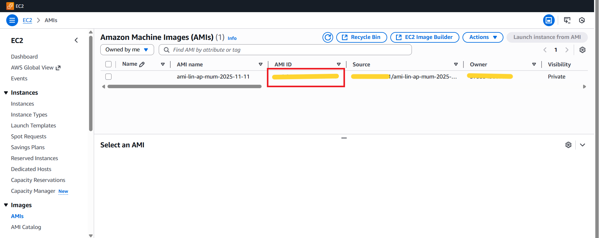
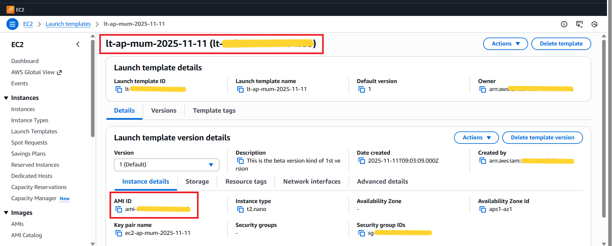
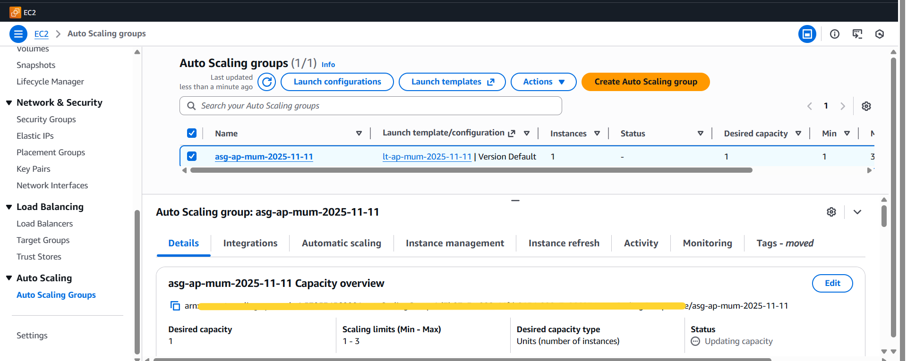
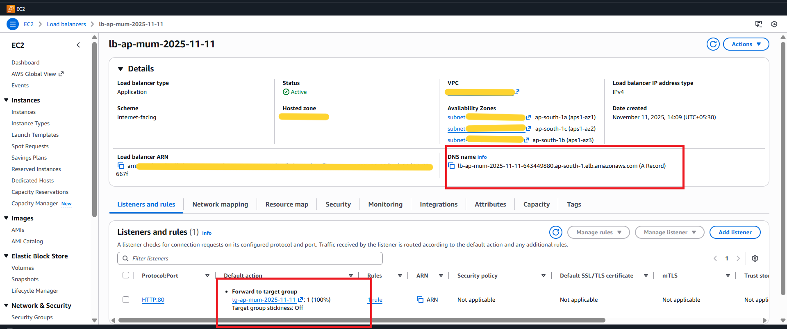
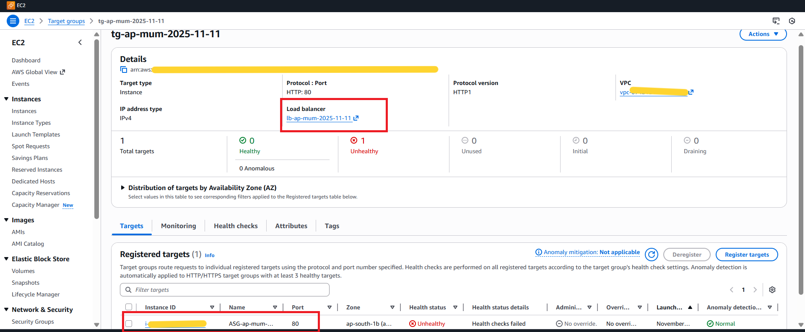
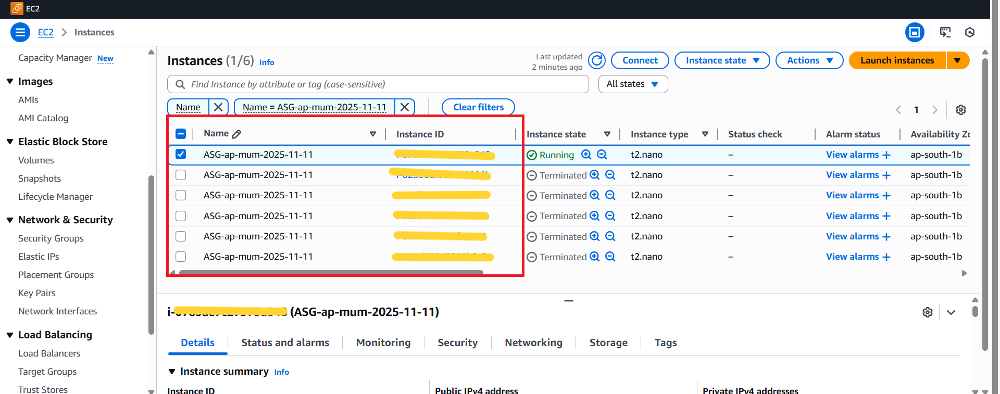

# AWS Application Load Balancer + Auto Scaling Group

> **Project:** Elastic, self-healing infrastructure using ALB, ASG, Custom AMI, and Launch Template  
> **Region:** ap-south-1 (Mumbai)  
> **Stack:** EC2 · ALB · Target Group · Auto Scaling Group · Custom AMI · Launch Template

---

## Table of Contents

1. [Project Overview](#project-overview)
2. [Architecture Summary](#architecture-summary)
3. [Step 1 — Custom AMI](#step-1--custom-ami)
4. [Step 2 — Launch Template](#step-2--launch-template)
5. [Step 3 — Auto Scaling Group](#step-3--auto-scaling-group)
6. [Step 4 — Application Load Balancer](#step-4--application-load-balancer)
7. [Step 5 — Target Group](#step-5--target-group)
8. [Step 6 — Instance Lifecycle History](#step-6--instance-lifecycle-history)
9. [How It All Works Together](#how-it-all-works-together)
10. [Key Technical Insights](#key-technical-insights)
11. [Scaling Policy Types](#scaling-policy-types)
12. [Real-World Use Cases](#real-world-use-cases)
13. [What I Learned](#what-i-learned)

---

## Project Overview

This project demonstrates how to build a **highly available, auto-scaling web infrastructure** on AWS. The goal was to create a system that:

- Automatically **scales out** (launches more instances) when traffic increases
- Automatically **scales in** (terminates excess instances) when traffic decreases
- **Replaces unhealthy instances** without any manual intervention
- Distributes all incoming traffic through a **single ALB endpoint**

The architecture follows a real-world production pattern used by teams running workloads that demand both **elasticity** and **resilience**.

---

## Architecture Summary

```
Custom AMI  ──────────►  Launch Template
                               │
                               │ References
                               ▼
Internet Users  ──►  ALB (HTTP:80)  ──►  Target Group  ──►  Auto Scaling Group
                                                                    │
                                              ┌─────────────────────┼─────────────────────┐
                                              ▼                     ▼                     ▼
                                        Instance 1           Instance 2           Instance 3
                                        (Running)            (Terminated)         (Terminated)
                                        t2.nano              t2.nano              t2.nano
```

**Flow:**
1. A custom AMI is created from a pre-configured base instance
2. A Launch Template references the AMI and defines instance configuration
3. An Auto Scaling Group uses the Launch Template to launch/terminate instances
4. An ALB receives all public traffic and forwards it to the Target Group
5. The Target Group routes requests to healthy ASG-managed instances
6. ASG monitors health and replaces failed instances automatically

---

## Step 1 — Custom AMI



A **Custom Amazon Machine Image (AMI)** was created from a pre-configured base EC2 instance. This follows the **Golden Image Pattern** — all application dependencies, configurations, and files are baked into the AMI so that every instance launched by the ASG is immediately ready to serve traffic.

| Property | Value |
|---|---|
| AMI Name | `ami-lin-ap-mum-2025-11-11` |
| AMI ID | `<redacted>` |
| Visibility | Private |
| Source | Owned account |
| Region | ap-south-1 |

**Why a Custom AMI?**

Using a custom AMI instead of a base AMI + user data script means:
- Instance launch time is faster (no install scripts to run)
- All instances are bit-for-bit identical — no configuration drift
- Rollbacks are simple — just point the Launch Template to the previous AMI version
- The application is always in a known-good state when the instance starts

---

## Step 2 — Launch Template



The **Launch Template** acts as the blueprint for every EC2 instance launched by the Auto Scaling Group. It defines all the configuration parameters so the ASG never needs manual input when spinning up a new instance.

| Property | Value |
|---|---|
| Template Name | `lt-ap-mum-2025-11-11` |
| Template ID | `<redacted>` |
| Default Version | 1 |
| AMI ID | `<redacted>` (Custom AMI above) |
| Instance Type | `t2.nano` |
| Key Pair | `ec2-ap-mum-2025-11-11` |
| Security Group | `<redacted>` |
| Availability Zone | aps1-az1 |

**Launch Template vs Launch Configuration**

> Launch Templates are the modern, recommended approach. They support **versioning** (you can maintain multiple versions and roll back), support **mixed instance types**, and are required for newer ASG features. AWS discourages using the older Launch Configurations.

---

## Step 3 — Auto Scaling Group



The **Auto Scaling Group (ASG)** is the core of the elastic infrastructure. It monitors instance health, maintains the desired capacity, and automatically launches or terminates instances based on demand.

| Property | Value |
|---|---|
| ASG Name | `asg-ap-mum-2025-11-11` |
| Launch Template | `lt-ap-mum-2025-11-11` (Version Default) |
| Minimum Capacity | 1 |
| Desired Capacity | 1 |
| Maximum Capacity | 3 |
| Availability Zones | ap-south-1a, ap-south-1b, ap-south-1c |
| Status | Updating capacity |

**Capacity Explanation**

| Setting | Value | Meaning |
|---|---|---|
| Minimum | 1 | At least 1 instance is always running — no cold starts |
| Desired | 1 | Normal operation target — ASG aims to maintain exactly 1 instance |
| Maximum | 3 | Hard ceiling — never launches more than 3 instances regardless of load |

**How ASG Maintains Desired State**

The ASG continuously reconciles the actual number of running instances against the desired count. If an instance is terminated (by a scale-in event or a health check failure), the ASG immediately launches a replacement using the Launch Template to restore the desired count.

---

## Step 4 — Application Load Balancer



The **Application Load Balancer (ALB)** is the single public entry point for all traffic. It operates at **Layer 7 (HTTP/HTTPS)** and distributes requests across all healthy instances registered in the Target Group.

| Property | Value |
|---|---|
| LB Name | `lb-ap-mum-2025-11-11` |
| Type | Application |
| Scheme | Internet-facing |
| IP Address Type | IPv4 |
| Status | Active |
| Listener | HTTP:80 |
| Default Action | Forward → Target Group (100%) |
| Stickiness | Off |
| Availability Zones | ap-south-1a · ap-south-1b · ap-south-1c |

**Why ALB over NLB?**

| Feature | ALB (Layer 7) | NLB (Layer 4) |
|---|---|---|
| Protocol | HTTP / HTTPS | TCP / UDP |
| Routing | Path-based, host-based | Connection-based |
| Use Case | Web apps, APIs | Gaming, streaming, low latency |
| Health Check | HTTP response code | TCP connection |

For HTTP web traffic distribution → **ALB is the correct choice**.

---

## Step 5 — Target Group



The **Target Group** acts as the bridge between the ALB and the ASG-managed EC2 instances. The ALB forwards all traffic to this group and performs continuous health checks on every registered instance.

| Property | Value |
|---|---|
| TG Name | `tg-ap-mum-2025-11-11` |
| Target Type | Instance |
| Protocol : Port | HTTP : 80 |
| Protocol Version | HTTP1 |
| IP Address Type | IPv4 |
| Load Balancer | `lb-ap-mum-2025-11-11` |

**Health Check Status at Time of Capture**

| Metric | Value |
|---|---|
| Total Targets | 1 |
| Healthy | 0 |
| Unhealthy | 1 |
| Status Detail | Health checks failed |

> **Note:** The unhealthy status was captured at the point when the web server on the running instance was not yet responding to HTTP health check pings on port 80. This is a transient state during instance initialization — once the application starts serving on port 80, the health check transitions to Healthy and the instance begins receiving traffic.

**How ASG Responds to Unhealthy Instances**

When the ALB health check type is enabled on the ASG, a health check failure triggers the ASG to:
1. Mark the instance as unhealthy
2. Terminate the failing instance
3. Launch a fresh replacement instance from the Launch Template
4. Register the new instance into the Target Group
5. Wait for it to pass health checks before sending traffic

This entire process is fully automated — **zero manual intervention required**.

---

## Step 6 — Instance Lifecycle History



The instance list shows a total of **6 ASG lifecycle events** — 1 instance currently running and 5 instances in a terminated state. All instances share the same name tag `ASG-ap-mum-2025-11-11` (automatically applied by the ASG).

| # | Instance | State | Type | AZ |
|---|---|---|---|---|
| 1 | Current instance | ● Running | t2.nano | ap-south-1b |
| 2 | Previous instance | ⊖ Terminated | t2.nano | ap-south-1b |
| 3 | Previous instance | ⊖ Terminated | t2.nano | ap-south-1b |
| 4 | Previous instance | ⊖ Terminated | t2.nano | ap-south-1b |
| 5 | Previous instance | ⊖ Terminated | t2.nano | ap-south-1b |
| 6 | Previous instance | ⊖ Terminated | t2.nano | ap-south-1b |

**What the history tells us:**

The 6 lifecycle events confirm that the ASG actively performed scale-out and scale-in operations during testing:

- **Scale-out events** — ASG detected increased demand (or a manual desired capacity change) and launched additional instances from the Launch Template
- **Scale-in events** — ASG detected reduced demand and terminated excess instances to return to desired capacity (1)
- **Self-healing** — Any instance that failed a health check was automatically replaced

All instance IDs are redacted for security.

---

## How It All Works Together

```
┌─────────────────────────────────────────────────────────────┐
│                    FULL REQUEST FLOW                        │
└─────────────────────────────────────────────────────────────┘

Step 1 │ User sends HTTP request to ALB DNS endpoint
       │
Step 2 │ ALB listener (HTTP:80) receives the request
       │
Step 3 │ Listener rule: Forward 100% → Target Group
       │
Step 4 │ Target Group selects a healthy registered instance
       │
Step 5 │ Request is proxied to the EC2 instance on port 80
       │
Step 6 │ Instance responds → ALB returns response to user
       │
Step 7 │ ALB health checks run every N seconds on all instances
       │
Step 8 │ If instance fails health check → ASG terminates it
       │                                 → Launches replacement
       │                                 → Re-registers into TG
       │
Step 9 │ If load increases → ASG scales out (up to Max: 3)
       │ If load decreases → ASG scales in  (down to Min: 1)
```

---

## Key Technical Insights

### 1. Golden AMI Pattern
Creating a custom AMI from a fully configured instance means every ASG-launched instance is **production-ready at boot** — no bootstrapping delay, no missing dependencies, no configuration drift between instances.

### 2. Launch Template Versioning
Launch Templates support multiple versions. This enables **safe rollouts** — you can update the template to a new AMI version, trigger an instance refresh on the ASG, and gradually replace instances with the new version while keeping old ones live during the transition.

### 3. ALB Health Check vs EC2 Health Check
The ASG supports two health check types:

| Type | What It Checks | When to Use |
|---|---|---|
| EC2 | Instance status (running/stopped) | Basic — only detects hardware failure |
| ELB | ALB health check result (HTTP response) | Advanced — detects app-level failures |

**Best practice:** Use ELB health check type on the ASG so application-level failures trigger replacement, not just instance-level failures.

### 4. Target Group Auto-Registration
The ASG is directly integrated with the Target Group. When a new instance is launched:
- It is automatically **registered** into the Target Group
- Traffic is only sent after it passes the configured health check grace period
- On termination, it is automatically **deregistered** and connections are drained

### 5. Scale-In Protection
Individual instances can be marked with **scale-in protection** to prevent termination during active long-running tasks — ensuring in-flight work is not interrupted during scale-down events.

---

## Scaling Policy Types

| Policy Type | How It Works | Best For |
|---|---|---|
| **Target Tracking** | Maintains a target metric (e.g. 60% CPU) automatically | Most common — let AWS manage the math |
| **Step Scaling** | Scale by defined steps based on CloudWatch alarm breach magnitude | Granular control over scale increments |
| **Simple Scaling** | Single fixed adjustment per alarm trigger | Legacy — use Step Scaling instead |
| **Scheduled Scaling** | Scale at predefined times (e.g. every weekday at 9AM) | Predictable traffic patterns |
| **Predictive Scaling** | ML-based forecasting for proactive scale-out ahead of predicted load | High-traffic events with historical patterns |

---

## Real-World Use Cases

| Use Case | How This Architecture Helps |
|---|---|
| **E-commerce flash sales** | ASG scales to 3× capacity during peak, scales back down saving cost |
| **APIs with variable load** | ALB distributes load, ASG matches capacity to actual demand |
| **Self-healing applications** | Failed instances are automatically replaced — no on-call alerts needed |
| **Blue/Green deployments** | Update Launch Template to new AMI version, trigger ASG instance refresh |
| **Multi-AZ high availability** | ASG distributes instances across AZs — a zone failure doesn't take down the service |
| **Cost optimization** | Min:1 keeps costs low during off-peak; Max:3 handles burst without over-provisioning |

---

## What I Learned

- **Custom AMIs eliminate bootstrapping inconsistency** — every instance launched by the ASG is identical and immediately production-ready
- **Launch Templates are the right way** to define instance config — versioning alone makes them far superior to Launch Configurations
- **ASG + ALB health check integration** is the key to true self-healing — without enabling ELB health check type on the ASG, app-level failures are invisible to the scaling system
- **Scale-out and scale-in** are not symmetric — scale-in has a default cooldown and termination policies (oldest instance, closest to billing hour) that must be understood to avoid unexpected behavior
- **The Target Group is the glue** — it abstracts the ALB from the ASG, allowing either to change independently
- **Desired capacity is the ASG's target** — it will always work to bring actual instance count back to desired, whether instances are added or removed

---