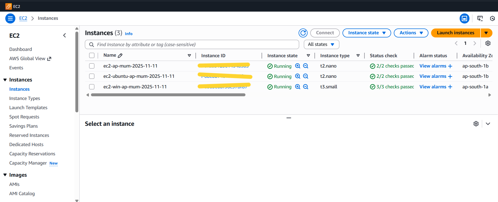
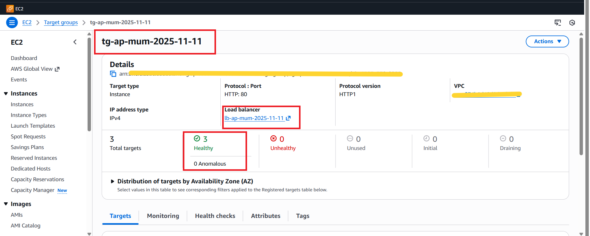
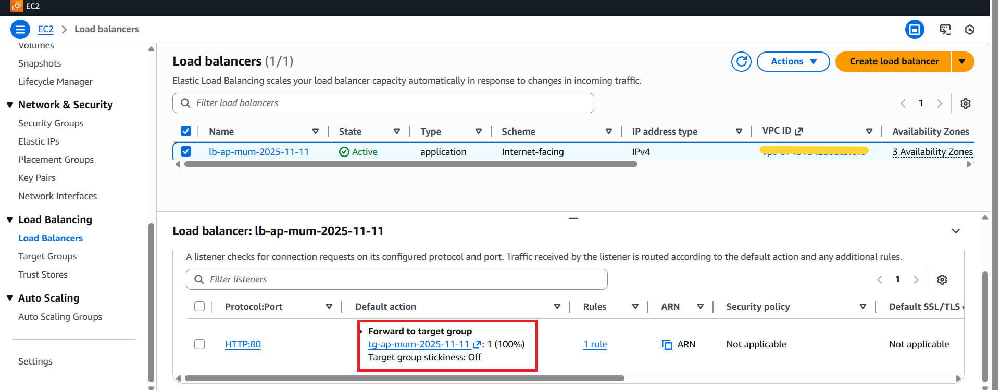
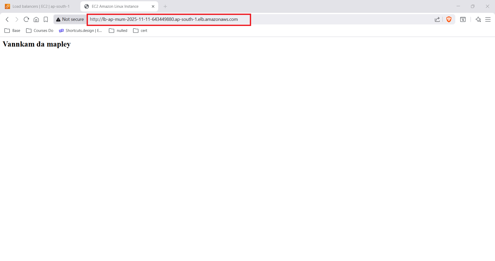
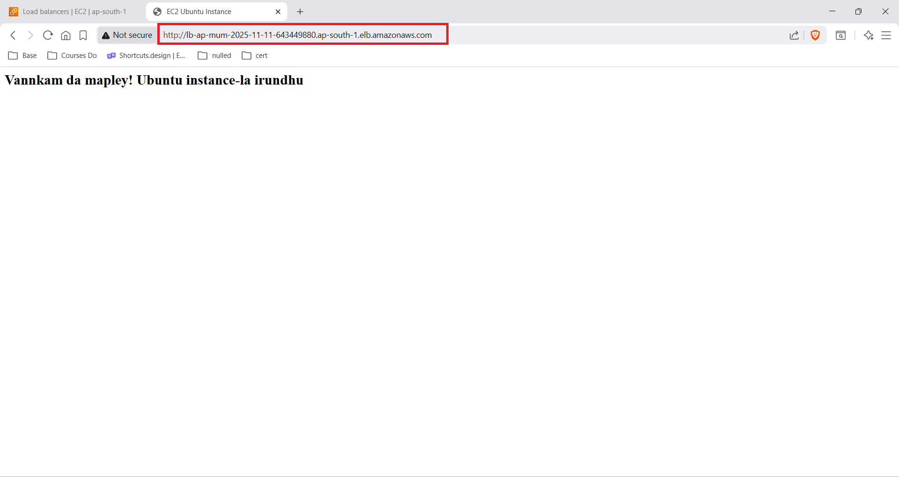
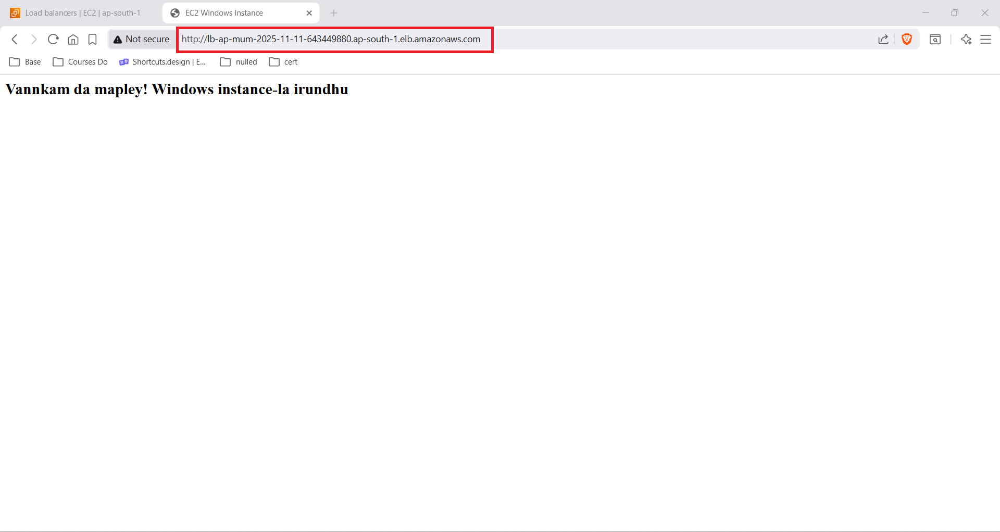

# AWS Application Load Balancer — Multi-Instance Traffic Distribution

> **Project:** HTTP traffic distribution across 3 mixed-OS EC2 instances using ALB  
> **Region:** ap-south-1 (Mumbai)  
> **Stack:** Application Load Balancer · EC2 Target Group · Amazon Linux 2023 · Ubuntu Linux · Windows Server

---

## Table of Contents

1. [Project Overview](#project-overview)
2. [Architecture Summary](#architecture-summary)
3. [Step 1 — EC2 Instances (3 Mixed OS)](#step-1--ec2-instances-3-mixed-os)
4. [Step 2 — Target Group](#step-2--target-group)
5. [Step 3 — Application Load Balancer](#step-3--application-load-balancer)
6. [Step 4 — Load Balancer Listener Rule](#step-4--load-balancer-listener-rule)
7. [Step 5 — Round-Robin Output Proof](#step-5--round-robin-output-proof)
8. [How It All Works Together](#how-it-all-works-together)
9. [Key Technical Insights](#key-technical-insights)
10. [ALB vs NLB vs CLB](#alb-vs-nlb-vs-clb)
11. [Real-World Use Cases](#real-world-use-cases)
12. [What I Learned](#what-i-learned)

---

## Project Overview

This project demonstrates how an **AWS Application Load Balancer (ALB)** distributes incoming HTTP traffic evenly across **three EC2 instances running different operating systems** — Amazon Linux 2023, Ubuntu Linux, and Windows Server. All three instances are registered in a single Target Group, and the ALB routes requests using the default **round-robin algorithm**.

The key insight: ALB is **completely OS-agnostic**. It does not care whether the backend is Linux or Windows — as long as the instance responds to HTTP health check pings on the configured port, it receives traffic.

---

## Architecture Summary

```
┌──────────────────────────────────────────────────────────┐
│               TRAFFIC DISTRIBUTION FLOW                  │
└──────────────────────────────────────────────────────────┘

Internet Users
    │
    │  HTTP · Port 80
    ▼
Application Load Balancer (ALB)
Internet-facing · ap-south-1 · 3 Availability Zones
    │
    │  Listener: HTTP:80
    │  Rule: Forward 100% → Target Group
    ▼
Target Group (tg-ap-mum-2025-11-11)
Type: Instance · Protocol: HTTP:80 · 3/3 Healthy
    │
    ├────────────────┬────────────────┐
    ▼                ▼                ▼
Instance 1      Instance 2       Instance 3
Amazon Linux    Ubuntu Linux     Windows Server
t2.nano         t2.nano          t3.small
ap-south-1b     ap-south-1b      ap-south-1a
Port 80         Port 80          Port 80
✅ Healthy      ✅ Healthy       ✅ Healthy
```

---

## Step 1 — EC2 Instances (3 Mixed OS)



Three EC2 instances were launched across two Availability Zones in ap-south-1. Each runs a different operating system and serves a unique HTTP response on port 80 to prove round-robin routing.

| Instance | Name | OS | Type | AZ | Port | Status |
|---|---|---|---|---|---|---|
| 1 | `ec2-ap-mum-2025-11-11` | Amazon Linux 2023 | t2.nano | ap-south-1b | 80 | ✅ Running |
| 2 | `ec2-ubuntu-ap-mum-2025-11-11` | Ubuntu Linux | t2.nano | ap-south-1b | 80 | ✅ Running |
| 3 | `ec2-win-ap-mum-2025-11-11` | Windows Server | t3.small | ap-south-1a | 80 | ✅ Running |

> All Instance IDs are redacted for security.

**Why t3.small for Windows?**

Windows Server requires more RAM than a minimal Linux instance. `t2.nano` (0.5 GB RAM) is insufficient for Windows — `t3.small` (2 GB RAM) provides the minimum viable memory for the OS to run stably and serve HTTP traffic.

**Web Server Setup per Instance**

| Instance | Web Server | Response Page |
|---|---|---|
| Amazon Linux 2023 | Apache HTTP | Unique response identifying Instance 1 |
| Ubuntu Linux | Apache / Nginx | Unique response identifying Instance 2 |
| Windows Server | IIS (Internet Information Services) | Unique response identifying Instance 3 |

Each instance was configured with a distinct HTML page so that each ALB request response can be traced back to the specific instance that served it — visually proving round-robin distribution.

---

## Step 2 — Target Group



A Target Group was created to register all three EC2 instances and act as the routing destination for the ALB.

| Property | Value |
|---|---|
| Target Group Name | `tg-ap-mum-2025-11-11` |
| Target Type | Instance |
| Protocol : Port | HTTP : 80 |
| Protocol Version | HTTP1 |
| IP Address Type | IPv4 |
| Load Balancer | `lb-ap-mum-2025-11-11` |
| Total Targets | 3 |
| Healthy | ✅ 3 |
| Unhealthy | ❌ 0 |
| Unused | 0 |
| Anomalous | 0 |

**Health Check Configuration**

The Target Group performs HTTP health checks on port 80 against all registered instances. An instance is considered healthy when it returns a `200 OK` response within the configured timeout.

All 3 instances passed health checks — confirming they are all correctly serving HTTP on port 80 and eligible to receive traffic.

**Registered Targets**

| Instance ID | Name | Port | AZ | Health Status |
|---|---|---|---|---|
| `<redacted>` | `ec2-win-ap-mum-2025-11-11` | 80 | ap-south-1a | ✅ Healthy |
| `<redacted>` | `ec2-ubuntu-ap-mum-2025-11-11` | 80 | ap-south-1b | ✅ Healthy |
| `<redacted>` | `ec2-ap-mum-2025-11-11` | 80 | ap-south-1b | ✅ Healthy |

---

## Step 3 — Application Load Balancer



The Application Load Balancer is the single public entry point for all HTTP traffic. It operates at **Layer 7 (HTTP)** and distributes requests across all healthy registered instances.

| Property | Value |
|---|---|
| LB Name | `lb-ap-mum-2025-11-11` |
| Type | Application |
| Scheme | Internet-facing |
| IP Address Type | IPv4 |
| Status | ✅ Active |
| Availability Zones | 3 AZs (ap-south-1) |
| VPC | `<redacted>` |

**Internet-Facing Scheme**

The `Internet-facing` scheme means the ALB has a public DNS endpoint accessible from the internet. The alternative is `Internal` — used for load balancers that only route traffic within a VPC (microservices, internal APIs).

---

## Step 4 — Load Balancer Listener Rule

The ALB listener is configured on `HTTP:80` with a single default rule that forwards **100% of traffic** to the Target Group.

| Property | Value |
|---|---|
| Protocol : Port | HTTP : 80 |
| Default Action | Forward to Target Group |
| Target Group | `tg-ap-mum-2025-11-11` · Weight: 1 (100%) |
| Target Group Stickiness | Off |
| Rules | 1 rule |

**Stickiness: Off**

With stickiness disabled, each HTTP request is independently routed to the next available healthy instance using round-robin — requests are not pinned to any specific instance. This maximizes even distribution.

If stickiness were enabled, the ALB would use a session cookie (`AWSALB`) to route all requests from the same client to the same instance for the duration of the session.

---

## Step 5 — Round-Robin Output Proof

Three successive requests to the same ALB DNS endpoint returned responses from three different instances — confirming the round-robin algorithm is working correctly.

### Instance 1 Response — Amazon Linux



```
Response from EC2 Instance 1
Server OS: Amazon Linux 2023
Status: Request Successfully Served
```

### Instance 2 Response — Ubuntu Linux



```
Response from EC2 Instance 2
Server OS: Ubuntu Linux
Status: Request Successfully Served
```

### Instance 3 Response — Windows Server



```
Response from EC2 Instance 3
Server OS: Windows Server
Status: Request Successfully Served
```

**Observation:** Each browser refresh hit a different instance in sequence — Amazon Linux → Ubuntu → Windows → back to Amazon Linux — confirming round-robin distribution is functioning correctly across all 3 targets.

---

## How It All Works Together

```
┌─────────────────────────────────────────────────────────────┐
│                    FULL REQUEST FLOW                        │
└─────────────────────────────────────────────────────────────┘

Step 1 │ Client sends HTTP request to ALB DNS endpoint
       │
Step 2 │ ALB listener (HTTP:80) receives the request
       │
Step 3 │ Listener evaluates rules → matches default rule
       │
Step 4 │ Default rule: Forward 100% → tg-ap-mum-2025-11-11
       │
Step 5 │ Target Group selects next healthy instance (round-robin)
       │   Request 1 → Instance 1 (Amazon Linux)
       │   Request 2 → Instance 2 (Ubuntu)
       │   Request 3 → Instance 3 (Windows)
       │   Request 4 → Instance 1 (cycle repeats)
       │
Step 6 │ ALB proxies request to selected instance on port 80
       │
Step 7 │ Instance processes request and returns HTTP response
       │
Step 8 │ ALB forwards response back to client
       │
Step 9 │ ALB performs health checks every N seconds
       │   Healthy → keeps receiving traffic
       │   Unhealthy → removed from rotation until recovered
```

---

## Key Technical Insights

### 1. ALB is OS-Agnostic
The ALB treats all registered instances identically. It does not inspect what OS runs on the instance — it only checks whether the instance responds to HTTP health checks on the configured port. Linux, Windows, containers — all are equal targets.

### 2. Round-Robin vs Least Outstanding Requests (LOR)

| Algorithm | How It Works | Best For |
|---|---|---|
| **Round-Robin** (default) | Each request goes to the next instance in sequence | Equal request processing time |
| **Least Outstanding Requests** | Routes to instance with fewest in-flight requests | Variable request durations |

Round-robin works well when all requests take roughly the same amount of time. LOR is better when some requests are heavy and others are lightweight.

### 3. Health Check Grace Period
When a new instance is registered (or comes back after a failure), the ALB waits for the health check grace period before sending traffic. This prevents routing requests to instances that are still initializing.

### 4. Connection Draining (Deregistration Delay)
When an instance is deregistered or fails a health check, the ALB stops sending new requests to it but **waits for in-flight requests to complete** before fully removing it. Default deregistration delay: 300 seconds.

### 5. Cross-Zone Load Balancing
With cross-zone load balancing enabled (default for ALB), the ALB distributes traffic evenly across all instances in all registered AZs — regardless of which AZ the client request enters through. This prevents AZ-level traffic imbalances.

---

## ALB vs NLB vs CLB

| Feature | ALB | NLB | CLB (Legacy) |
|---|---|---|---|
| OSI Layer | Layer 7 (HTTP/HTTPS) | Layer 4 (TCP/UDP) | Layer 4 + 7 |
| Routing | Path, host, header, query | IP, port | Basic |
| Protocol Support | HTTP, HTTPS, WebSocket, gRPC | TCP, UDP, TLS | HTTP, HTTPS, TCP |
| Use Case | Web apps, APIs, microservices | Gaming, IoT, low-latency | Legacy workloads |
| Static IP | ❌ (use Global Accelerator) | ✅ Yes | ❌ |
| Latency | Moderate | Ultra-low | Moderate |
| Health Check | HTTP/HTTPS response code | TCP connection | HTTP/HTTPS/TCP |
| AWS Recommendation | ✅ Current standard | ✅ Current standard | ⚠️ Legacy — migrate |

---

## Real-World Use Cases

| Use Case | How ALB Helps |
|---|---|
| **Horizontal scaling** | Add instances behind ALB to handle more load |
| **Zero-downtime deployments** | Deregister instance → update → re-register |
| **Multi-AZ high availability** | Instances across AZs — zone failure doesn't affect service |
| **Microservices routing** | Path-based rules (`/api/*` → service A, `/web/*` → service B) |
| **Blue/Green deployments** | Two Target Groups, switch listener rule between them |
| **Canary releases** | Weighted routing — 90% to stable, 10% to new version |

---

## What I Learned

- **ALB is entirely OS-agnostic** — the backend OS type is irrelevant to the load balancer; it only cares about HTTP health check responses
- **Round-robin is the default algorithm** — it works best when request processing times are roughly equal across instances
- **Stickiness off = true load distribution** — enabling stickiness pins users to instances, which can cause uneven load
- **Target Group health checks are independent** — each instance is health-checked individually; one failing instance doesn't affect others
- **Windows instances need more compute** — t2.nano is not viable for Windows Server; t3.small (or larger) is the minimum
- **Cross-zone load balancing (default on ALB)** ensures even distribution regardless of where traffic enters — without it, AZs with fewer instances receive disproportionate load
- **Deregistration delay** is critical for graceful instance removal — always allow in-flight requests to drain before termination

---