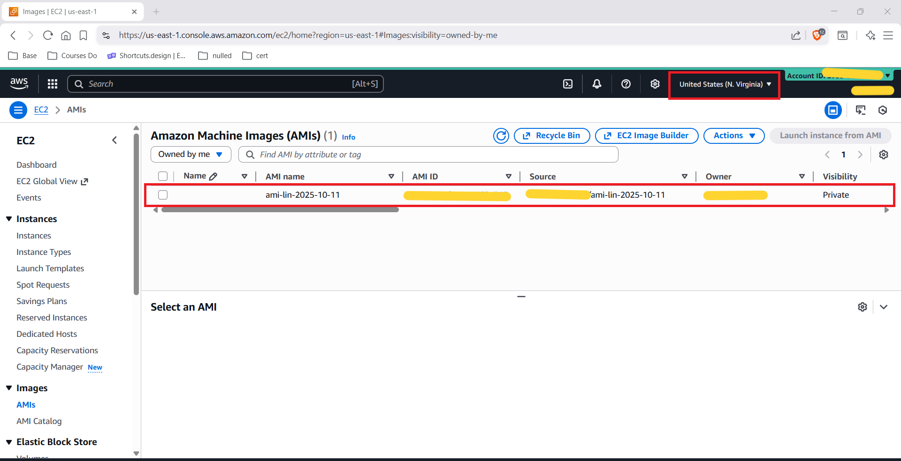
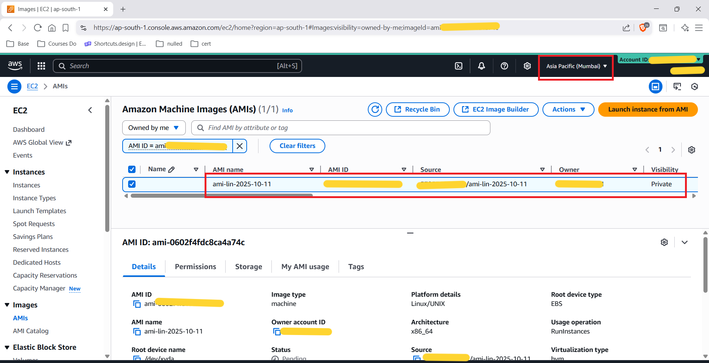

# 🖼️ AMI Cross-Region Copy

> **Create a Custom AMI in us-east-1 (N. Virginia) → Copy to ap-south-1 (Mumbai) — Multi-Region EC2 Portability**

| Field            | Value                                                     |
|------------------|-----------------------------------------------------------|
| **Source Region**| us-east-1 (N. Virginia)                                  |
| **Dest Region**  | ap-south-1 (Mumbai)                                      |
| **AMI Name**     | ami-lin-2025-10-11                                        |
| **Platform**     | Linux/UNIX · x86_64 · hvm · EBS root device              |
| **Visibility**   | Private                                                   |

---

## 📋 Table of Contents

1. [Project Overview](#-project-overview)
2. [Architecture Summary](#-architecture-summary)
3. [Step 1 — Custom AMI in us-east-1](#-step-1--custom-ami-in-us-east-1)
4. [Step 2 — AMI Copied to ap-south-1 (Mumbai)](#-step-2--ami-copied-to-ap-south-1-mumbai)
5. [AMI Details Explained](#-ami-details-explained)
6. [Key Technical Insights](#-key-technical-insights)
7. [AMI vs Snapshot — Comparison](#-ami-vs-snapshot--comparison)
8. [AMI Visibility Options](#-ami-visibility-options)
9. [Real-World Use Cases](#-real-world-use-cases)
10. [What I Learned](#-what-i-learned)
11. [Architecture Diagram](#-architecture-diagram)
12. [GitHub Folder Structure](#-github-folder-structure)

---

## 🔍 Project Overview

This project demonstrates **AMI (Amazon Machine Image) cross-region copy** — a critical skill for multi-region cloud deployments and disaster recovery strategies.

The workflow:
1. An Amazon Linux EC2 instance in **us-east-1** was configured and a custom AMI (`ami-lin-2025-10-11`) was created from it.
2. The AMI was **copied to ap-south-1 (Mumbai)** using the AWS Console (Actions → Copy AMI).
3. AWS automatically copied the backing **EBS snapshot** to the destination region.
4. The copied AMI appeared in the Mumbai console with a **new AMI ID** and status **Pending** → Available.
5. The AMI can now be used to **launch identical EC2 instances in Mumbai** without manual re-configuration.

---

## 🏗️ Architecture Summary

```
┌─────────────────────────────────────────────────────────────────────────┐
│                    AMI Cross-Region Copy — Architecture                 │
├─────────────────────────────────────────────────────────────────────────┤
│                                                                         │
│   ┌──────────────────────────────────────────────────────────────────┐  │
│   │  SOURCE REGION: us-east-1 (N. Virginia)                          │  │
│   │                                                                  │  │
│   │  Amazon Linux EC2                                                │  │
│   │  ┌─────────────┐    Create Image    ┌────────────────────┐      │  │
│   │  │ ec2-lin-    │ ─────────────────► │ Custom AMI         │      │  │
│   │  │ 2025-10-11  │                    │ ami-lin-2025-10-11 │      │  │
│   │  └─────────────┘                    │ Private · Linux    │      │  │
│   │                                     └─────────┬──────────┘      │  │
│   │                                               │ backed by       │  │
│   │                                     ┌─────────▼──────────┐      │  │
│   │                                     │ EBS Snapshot       │      │  │
│   │                                     │ (auto-created)     │      │  │
│   │                                     └────────────────────┘      │  │
│   └───────────────────────────┬──────────────────────────────────────┘  │
│                               │ Actions → Copy AMI → ap-south-1         │
│                               │ (cross-region snapshot transfer)         │
│   ┌───────────────────────────▼──────────────────────────────────────┐  │
│   │  DESTINATION REGION: ap-south-1 (Mumbai)                         │  │
│   │                                                                  │  │
│   │  ┌────────────────────┐    Launch     ┌─────────────────────┐   │  │
│   │  │ Copied AMI         │ ────────────► │ New EC2 Instance    │   │  │
│   │  │ ami-lin-2025-10-11 │               │ Identical config    │   │  │
│   │  │ Status: Pending    │               │ in Mumbai           │   │  │
│   │  └─────────┬──────────┘               └─────────────────────┘   │  │
│   │            │ backed by                                           │  │
│   │  ┌─────────▼──────────┐                                         │  │
│   │  │ Copied Snapshot    │                                          │  │
│   │  │ (in ap-south-1)    │                                          │  │
│   │  └────────────────────┘                                          │  │
│   └──────────────────────────────────────────────────────────────────┘  │
│                                                                         │
└─────────────────────────────────────────────────────────────────────────┘
```

---

## 📷 Step 1 — Custom AMI in us-east-1



### What This Shows

The EC2 AMI console in **us-east-1 (N. Virginia)** showing the custom AMI created from the Amazon Linux EC2 instance.

| Field          | Value                               |
|----------------|-------------------------------------|
| **AMI Name**   | ami-lin-2025-10-11                  |
| **AMI ID**     | `<ami-id-us-east-1>` (redacted)    |
| **Source**     | `<account-id>`/ami-lin-2025-10-11  |
| **Owner**      | `<account-id>` (redacted)          |
| **Visibility** | Private                             |
| **Region**     | us-east-1 (N. Virginia)            |
| **Console**    | EC2 → Images → AMIs                 |

### Key Observations

- **Owned by me** filter is active — only your custom AMIs are shown.
- **1 AMI** listed — the single custom AMI created from the Amazon Linux EC2.
- **Private** visibility — only your account can use this AMI.
- The **"Launch instance from AMI"** button is greyed out until you select the AMI row.

---

## 📷 Step 2 — AMI Copied to ap-south-1 (Mumbai)



### What This Shows

The EC2 AMI console in **ap-south-1 (Mumbai)** showing the copied AMI with its full details panel.

| Field               | Value                                    |
|---------------------|------------------------------------------|
| **AMI Name**        | ami-lin-2025-10-11                       |
| **AMI ID**          | `<ami-id-ap-south-1>` (redacted)        |
| **Source**          | `<account-id>`/ami-lin-2025-10-11       |
| **Owner**           | `<account-id>` (redacted)               |
| **Visibility**      | Private                                  |
| **Region**          | ap-south-1 (Mumbai)                     |
| **Image type**      | machine                                  |
| **Platform details**| Linux/UNIX                               |
| **Architecture**    | x86_64                                   |
| **Root device name**| /dev/xvda                               |
| **Root device type**| EBS                                      |
| **Virtualization**  | hvm                                      |
| **Usage operation** | RunInstances                             |
| **Status**          | Pending (copy in progress at screenshot) |

### Key Observations

- A **new AMI ID** was assigned in ap-south-1 — AMI IDs are region-specific.
- The **AMI name** (`ami-lin-2025-10-11`) is preserved — names carry over.
- **Status: Pending** means the backing EBS snapshot is still being transferred to Mumbai.
- The **filter** shows `AMI ID = <ami-id-ap-south-1>` — filtered by specific AMI.
- AWS Console region switcher confirms **Asia Pacific (Mumbai)**.

---

## 🔎 AMI Details Explained

| Property           | Value        | What It Means                                              |
|--------------------|--------------|-------------------------------------------------------------|
| **Image type**     | machine      | Full machine image (not a kernel or ramdisk)               |
| **Platform**       | Linux/UNIX   | Operating system family                                    |
| **Architecture**   | x86_64       | 64-bit Intel/AMD — compatible with most instance types     |
| **Root device**    | EBS          | Boot volume is EBS (persists after stop/start)             |
| **Root dev name**  | /dev/xvda    | Device path of the root volume inside the instance         |
| **Virtualization** | hvm          | Hardware Virtual Machine — full hardware emulation, required for modern instance types |
| **Usage operation**| RunInstances | EC2 RunInstances API call is used to launch from this AMI  |
| **Visibility**     | Private      | Only your AWS account can launch from this AMI             |
| **Status**         | Pending      | AMI not yet available for launch; snapshot transfer ongoing |

---

## 🔑 Key Technical Insights

### 1. AMIs Are Region-Scoped
- An AMI exists in **exactly one region**.
- You **cannot** launch an EC2 in ap-south-1 using an AMI from us-east-1.
- You must **explicitly copy** the AMI to make it available in another region.

### 2. AMI = Snapshot + Metadata
- An AMI is NOT just a single file. It is a bundle of:
  - **EBS snapshots** (one per volume in the original EC2)
  - **Block device mappings** (which snapshots attach where)
  - **Launch permissions** (who can use the AMI)
  - **Kernel and virtualization type** metadata
- Copying an AMI copies **all backing snapshots** to the destination region.

### 3. New AMI ID in Destination
- AMI IDs are **regional identifiers**.
- After copying, the destination AMI gets a **completely new AMI ID**.
- The AMI name (`ami-lin-2025-10-11`) is preserved for human readability.

### 4. Copy Is Asynchronous
- AMI copy triggers a background **snapshot transfer** across regions.
- Status goes: **Pending → Available**.
- The AMI is **only launchable** once status = Available.

### 5. Copied AMI Is Independent
- Deleting the source AMI does **NOT** affect the copied AMI.
- Deregistering the source does **NOT** delete the destination copy.
- Each copy is a fully independent resource with its own lifecycle.

### 6. Billing for Both Regions
- You are billed for **snapshot storage in both regions** after copying.
- The source region keeps its snapshot; the destination gets its own copy.
- Delete snapshots you no longer need to avoid unnecessary costs.

---

## 📊 AMI vs Snapshot — Comparison

| Feature               | EBS Snapshot                           | AMI                                                |
|-----------------------|----------------------------------------|----------------------------------------------------|
| **What it captures**  | One EBS volume                         | Full EC2: all volumes + metadata + permissions     |
| **Launch EC2?**       | ❌ Cannot directly                     | ✅ Yes — Launch instance from AMI                  |
| **Create volume?**    | ✅ Yes                                 | Not directly (must extract snapshot from AMI)      |
| **Region-scoped?**    | ✅ Yes                                 | ✅ Yes                                             |
| **Cross-region copy** | EC2 → Snapshots → Copy                | EC2 → AMIs → Copy AMI                              |
| **Typical use**       | Volume backup, restore, migration      | Instance cloning, golden image, auto scaling       |
| **Auto-created**      | When you create an AMI                 | Manually via "Create Image" action                 |
| **Independent delete**| Yes                                    | Deregister AMI; then delete backing snapshot       |

---

## 🔒 AMI Visibility Options

| Visibility    | Who Can Use                     | Use Case                                         |
|---------------|---------------------------------|--------------------------------------------------|
| **Private**   | Your AWS account only           | Internal images, company AMIs                   |
| **Shared**    | Specific AWS account IDs        | Share with partner accounts or team accounts    |
| **Public**    | All AWS accounts worldwide      | Open-source images, AWS Marketplace submissions |

> **This project**: Private — only your account (`<account-id>`) can launch from this AMI.

---

## 🌍 Real-World Use Cases

| Scenario                          | How AMI Cross-Region Copy Helps                                           |
|-----------------------------------|---------------------------------------------------------------------------|
| **Multi-Region DR**               | Keep a golden AMI copy in each failover region — launch instantly on disaster |
| **Global Deployments**            | Roll out the same app server config across us-east-1, eu-west-1, ap-south-1 |
| **Immutable Infrastructure**      | Bake your app into an AMI → deploy consistently everywhere (no config drift) |
| **Dev/Test Parity**               | Copy prod AMI to a cheaper region for realistic testing without touching prod |
| **Auto Scaling in New Region**    | Provide the copied AMI as the Launch Template source for a regional ASG    |
| **AMI Marketplace**               | Copy and share configured images with other AWS accounts or customers       |

---

## 💡 What I Learned

1. **AMIs are region-locked** — this was the core lesson. I couldn't just change the region and launch; I had to go through the Copy AMI process.

2. **The copy process is fully managed** — AWS handles the cross-region snapshot transfer automatically. You just select the destination region and click Copy.

3. **Pending status is normal** — the AMI appears immediately in the destination console but can't be launched until the status flips to Available (snapshot transfer completes).

4. **A new AMI ID is always assigned** — this matters for automation scripts and Launch Templates that reference AMI IDs by value. Always use parameter stores or dynamic lookups in prod.

5. **Snapshot billing is per-region** — after copying, you're paying for snapshot storage in BOTH regions. Automate snapshot/AMI lifecycle management with AWS Backup or custom Lambda functions.

6. **For SAA-C03**: AMI copy is the recommended approach for cross-region replication. AMIs underpin Auto Scaling Groups (Launch Templates) — knowing how to distribute AMIs across regions is key to multi-region high availability.

7. **hvm vs pv**: Modern EC2 instances require **HVM (Hardware Virtual Machine)** virtualization. PV (Paravirtual) is legacy and not supported on newer instance families. Always use hvm.

---

### Quick Reference: Copy AMI via AWS CLI

```bash
# Copy AMI from us-east-1 to ap-south-1
aws ec2 copy-image \
  --region ap-south-1 \
  --source-region us-east-1 \
  --source-image-id <source-ami-id> \
  --name "ami-lin-2025-10-11" \
  --description "Copied from us-east-1"

# Check copy status in destination region
aws ec2 describe-images \
  --region ap-south-1 \
  --image-ids <new-ami-id> \
  --query 'Images[0].State'

# Launch EC2 from copied AMI in ap-south-1
aws ec2 run-instances \
  --region ap-south-1 \
  --image-id <new-ami-id> \
  --instance-type t2.micro \
  --key-name <your-key-pair>
```

---