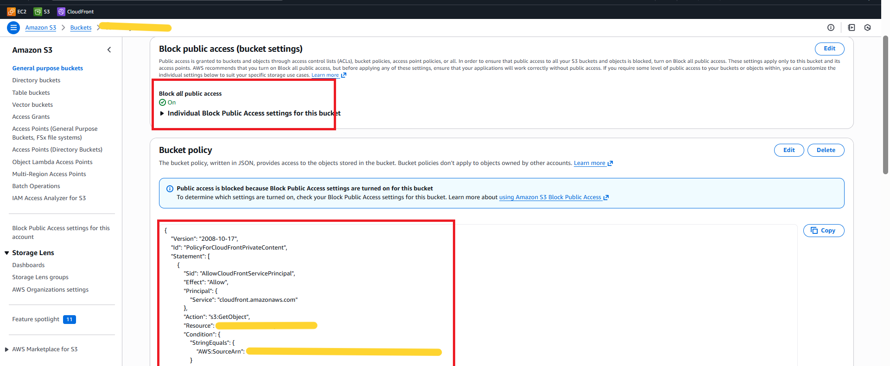
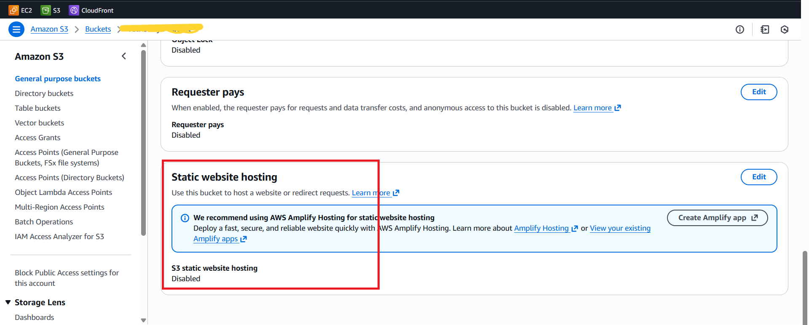
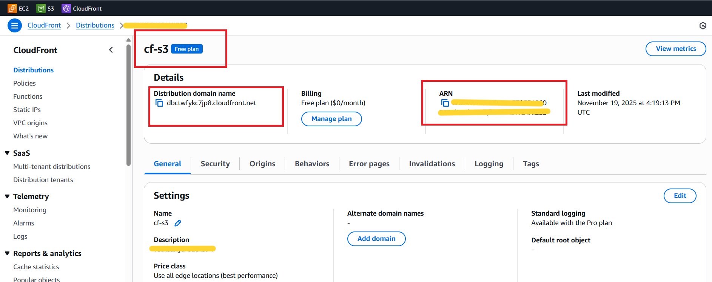
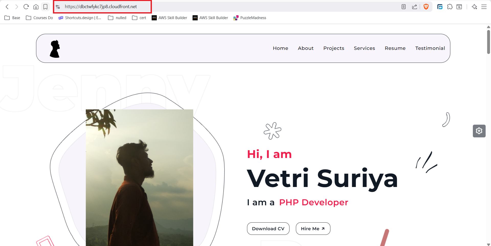
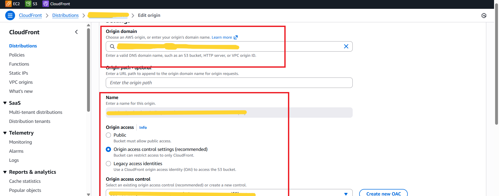

# AWS CloudFront + S3 — Secure Static Website Hosting with OAC

> **Project:** Globally distributed static website using CloudFront as delivery layer and private S3 as origin  
> **Bucket:** vetrisuriya-bucket-1  
> **Region:** ap-south-1 (Mumbai)  
> **Stack:** Amazon CloudFront · Amazon S3 · Origin Access Control (OAC) · Bucket Policy

---

## Table of Contents

1. [Project Overview](#project-overview)
2. [Architecture Summary](#architecture-summary)
3. [Step 1 — S3 Bucket Configuration](#step-1--s3-bucket-configuration)
4. [Step 2 — Block Public Access](#step-2--block-public-access)
5. [Step 3 — Static Website Hosting Disabled](#step-3--static-website-hosting-disabled)
6. [Step 4 — CloudFront Distribution](#step-4--cloudfront-distribution)
7. [Step 5 — Origin Access Control (OAC)](#step-5--origin-access-control-oac)
8. [Step 6 — Bucket Policy](#step-6--bucket-policy)
9. [Step 7 — Portfolio Website Live](#step-7--portfolio-website-live)
10. [How It All Works Together](#how-it-all-works-together)
11. [Key Technical Insights](#key-technical-insights)
12. [CloudFront vs Direct S3 Hosting](#cloudfront-vs-direct-s3-hosting)
13. [OAC vs Legacy OAI](#oac-vs-legacy-oai)
14. [Real-World Use Cases](#real-world-use-cases)
15. [What I Learned](#what-i-learned)

---

## Project Overview

This project demonstrates how to host a **secure, globally distributed static website** on AWS using **CloudFront as the CDN delivery layer** and **Amazon S3 as a completely private origin**. The portfolio website is accessible worldwide over HTTPS via CloudFront — but the S3 bucket is entirely private, with no public endpoint exposed.

The key challenge: How do you serve a static website from S3 globally at low latency over HTTPS — without ever making the bucket public?

**Answer:** CloudFront + S3 with Origin Access Control (OAC).

---

## Architecture Summary

```
┌─────────────────────────────────────────────────────────────┐
│                   SECURE DELIVERY FLOW                      │
└─────────────────────────────────────────────────────────────┘

End User (Any Region)
    │
    │  HTTPS Request
    ▼
CloudFront Edge Location (Nearest PoP)
    │
    │  Cache Hit? → Return cached content immediately
    │
    │  Cache Miss? → Fetch from origin
    ▼
CloudFront Distribution (cf-s3)
    │
    │  OAC signs request with SigV4
    ▼
Origin Access Control (OAC)
    │
    │  Authenticated fetch (signed request)
    ▼
S3 Bucket (Private · ap-south-1)
    │  Block Public Access: ON
    │  Static Website Hosting: DISABLED
    │  Bucket Policy: Allow only CloudFront
    │
    ▼
Returns object to CloudFront → Cached at Edge → Delivered to User


Direct S3 Access Attempt:
    Any Client → S3 Bucket URL → 403 Access Denied ❌
```

---

## Step 1 — S3 Bucket Configuration

The S3 bucket `vetrisuriya-bucket-1` in `ap-south-1` (Mumbai) serves as the **private origin** for the CloudFront distribution. It stores all static website assets: HTML, CSS, JavaScript, and images.

| Property | Value |
|---|---|
| Bucket Name | `vetrisuriya-bucket-1` |
| Region | ap-south-1 (Mumbai) |
| Purpose | Static website asset storage |
| Access Model | Private — accessible only via CloudFront |
| Object Lock | Disabled |
| Requester Pays | Disabled |

---

## Step 2 — Block Public Access



**Block All Public Access** is turned `ON` for the bucket. This is the foundational security setting that ensures no object in this bucket can ever be made publicly accessible — regardless of individual object ACLs or other policies.

| Setting | Status |
|---|---|
| Block all public access | ✅ ON |
| Block public ACLs | ✅ ON |
| Block public bucket policies | ✅ ON |
| Ignore public ACLs | ✅ ON |
| Restrict public bucket policies | ✅ ON |

**Why this matters:** Even if someone accidentally sets an object ACL to public, the Block Public Access setting overrides it. This is a safety net that prevents accidental exposure of any bucket content.

---

## Step 3 — Static Website Hosting Disabled



S3 Static Website Hosting is intentionally **Disabled**.

| Setting | Status |
|---|---|
| S3 Static Website Hosting | ❌ Disabled |

**Why disable it?**

When S3 Static Website Hosting is enabled, AWS creates a public HTTP endpoint like:
```
http://vetrisuriya-bucket-1.s3-website.ap-south-1.amazonaws.com
```

This endpoint is HTTP only (no HTTPS) and effectively bypasses all access restrictions. By disabling it:
- The public S3 website endpoint does not exist
- There is no HTTP URL that exposes bucket content
- **CloudFront is the only valid delivery mechanism**

---

## Step 4 — CloudFront Distribution



The CloudFront distribution `cf-s3` is configured as the global content delivery layer, serving the portfolio website from edge locations worldwide.

| Property | Value |
|---|---|
| Distribution Name | `cf-s3` |
| Distribution ID | `<redacted>` |
| Distribution Domain | `<redacted>.cloudfront.net` |
| ARN | `<redacted>` |
| Billing Plan | Free Plan ($0/month) |
| Price Class | Use all edge locations (best performance) |
| Description | `vetrisuriya-bucket-1` |
| Alternate Domain Names | None configured |
| Default Root Object | Not set |
| Standard Logging | Available with Pro plan |
| Last Modified | November 19, 2025 |

**Price Class — All Edge Locations**

Using all edge locations means CloudFront caches and serves content from PoPs (Points of Presence) across Asia, Europe, North America, South America, and Oceania — delivering the lowest possible latency to every user worldwide.

---

## Step 5 — Origin Access Control (OAC)



The CloudFront distribution uses **Origin Access Control (OAC)** — the modern, recommended method for authorizing CloudFront to access a private S3 bucket.

| Property | Value |
|---|---|
| Origin Domain | `vetrisuriya-bucket-1.s3.ap-south-1.amazonaws.com` |
| Origin Access | Origin Access Control Settings (Recommended) |
| OAC Name | `<redacted>` |
| Signing Protocol | SigV4 |

**How OAC Works**

When CloudFront fetches an object from S3, it uses OAC to **cryptographically sign the request** using AWS Signature Version 4 (SigV4). S3 then validates this signature against the bucket policy before serving the object.

The bucket policy includes an `AWS:SourceArn` condition pinned to the **exact CloudFront distribution ARN** — so even if another CloudFront distribution tried to access this bucket, it would be denied.

---

## Step 6 — Bucket Policy

The bucket policy is the final enforcement layer. It explicitly allows only the CloudFront service principal — from the specific distribution — to call `s3:GetObject`.

```json
{
  "Version": "2008-10-17",
  "Id": "PolicyForCloudFrontPrivateContent",
  "Statement": [
    {
      "Sid": "AllowCloudFrontServicePrincipal",
      "Effect": "Allow",
      "Principal": {
        "Service": "cloudfront.amazonaws.com"
      },
      "Action": "s3:GetObject",
      "Resource": "arn:aws:s3:::<bucket-name>/*",
      "Condition": {
        "StringEquals": {
          "AWS:SourceArn": "arn:aws:cloudfront::<account-id>:distribution/<dist-id>"
        }
      }
    }
  ]
}
```

> All sensitive values (bucket name, account ID, distribution ID) are redacted.

**Policy Breakdown**

| Element | Value | Purpose |
|---|---|---|
| `Principal` | `cloudfront.amazonaws.com` | Only CloudFront service can access |
| `Action` | `s3:GetObject` | Read-only — cannot write, delete, or list |
| `Resource` | `<bucket>/*` | All objects in the bucket |
| `Condition` | `AWS:SourceArn` | Pinned to this exact CF distribution |

The `AWS:SourceArn` condition is the critical security element — it ensures the policy is not a blanket allow for all CloudFront distributions, but only for this specific one.

---

## Step 7 — Portfolio Website Live



The portfolio website is successfully served over HTTPS via the CloudFront distribution domain. The site loads globally with edge caching, and the S3 bucket URL is never exposed.

| Verification | Result |
|---|---|
| Access via CloudFront domain | ✅ Works |
| Content served over HTTPS | ✅ Yes |
| S3 bucket URL accessible | ❌ 403 Access Denied |
| S3 website endpoint accessible | ❌ Does not exist (disabled) |

---

## How It All Works Together

```
┌─────────────────────────────────────────────────────────────┐
│               COMPLETE REQUEST FLOW                         │
└─────────────────────────────────────────────────────────────┘

Step 1 │ User enters CloudFront domain in browser
       │
Step 2 │ DNS resolves to nearest CloudFront edge location
       │
Step 3 │ Edge checks cache for the requested object
       │
Step 4 │ Cache HIT  → Return cached object immediately ✅
       │ Cache MISS → Forward request to origin
       │
Step 5 │ CloudFront uses OAC to sign the origin request (SigV4)
       │
Step 6 │ Signed request arrives at S3
       │
Step 7 │ S3 validates:
       │   • Is Principal = cloudfront.amazonaws.com? ✅
       │   • Is AWS:SourceArn = this distribution?    ✅
       │   • Is Action = s3:GetObject?                ✅
       │
Step 8 │ S3 returns the object to CloudFront
       │
Step 9 │ CloudFront caches the object at the edge
       │
Step 10│ CloudFront returns the object to the user over HTTPS
       │
       │ --- BLOCKED PATH ---
       │
Step X │ Direct S3 bucket URL request
       │   → Block Public Access: ON → 403 Access Denied ❌
```

---

## Key Technical Insights

### 1. Block Public Access is a Hard Guard
Even with a permissive bucket policy, Block Public Access at the bucket level overrides everything. It is the safety net that prevents any accidental public exposure — set it ON and leave it ON.

### 2. Disabling Static Website Hosting Removes the Attack Surface
Enabling S3 Static Website Hosting creates an HTTP endpoint that bypasses all IAM and bucket policy controls for public objects. Keeping it disabled eliminates this endpoint entirely — there is simply no URL to attack.

### 3. OAC vs OAI — Always Choose OAC

| Feature | OAC (New) | OAI (Legacy) |
|---|---|---|
| Signing | SigV4 | Custom signing |
| S3 SSE-KMS Support | ✅ Yes | ❌ No |
| All S3 API Support | ✅ Yes | Limited |
| AWS Recommendation | ✅ Current standard | ⚠️ Legacy |

### 4. AWS:SourceArn Prevents Cross-Distribution Access
Without the `AWS:SourceArn` condition, any CloudFront distribution in any AWS account could access your bucket (if they knew the bucket name). The condition pins the policy to exactly one distribution — yours.

### 5. CloudFront Caching Reduces S3 Costs
Every cache hit at a CloudFront edge means one fewer `s3:GetObject` API call. With high cache-hit ratios, S3 GET request costs drop significantly — CloudFront pays for itself on high-traffic sites.

---

## CloudFront vs Direct S3 Hosting

| Feature | CloudFront + Private S3 | S3 Static Website Hosting |
|---|---|---|
| HTTPS | ✅ Yes (default) | ❌ HTTP only |
| Custom Domain + SSL | ✅ ACM certificate | Limited |
| Global Edge Caching | ✅ 400+ PoPs | ❌ Single region |
| Bucket Visibility | ✅ Fully private | ❌ Must be public |
| Security | ✅ OAC + Bucket Policy | Weaker |
| Cost at Scale | Lower (edge caching) | Higher (direct S3 GETs) |
| DDoS Protection | ✅ AWS Shield Standard | ❌ None |

---

## OAC vs Legacy OAI

| Aspect | OAC | OAI |
|---|---|---|
| Full name | Origin Access Control | Origin Access Identity |
| Authentication | SigV4 request signing | Custom identity-based |
| SSE-KMS encrypted buckets | ✅ Supported | ❌ Not supported |
| AWS recommendation | ✅ Use this | ⚠️ Legacy — migrate away |
| Policy element | `AWS:SourceArn` condition | `CanonicalUser` principal |
| Cross-account support | ✅ Yes | Limited |

---

## Real-World Use Cases

| Use Case | How This Architecture Helps |
|---|---|
| **Portfolio websites** | Secure, global, HTTPS by default |
| **React / Vue / Angular SPAs** | Deploy build output to S3, serve via CloudFront |
| **Marketing landing pages** | Fast global delivery with edge caching |
| **Internal document portals** | Signed URLs via CloudFront for secure access |
| **Multi-region asset delivery** | Single origin, globally cached |
| **Cost-efficient static hosting** | Pay for S3 storage + minimal CloudFront GETs |

---

## What I Learned

- **Block Public Access + Disabled Static Hosting + OAC** is the correct security triad for private S3 origins — each layer addresses a different attack vector
- **OAC is the modern standard** — the `AWS:SourceArn` condition is what makes it strictly secure, not just the service principal alone
- **Disabling Static Website Hosting is intentional** — it eliminates the HTTP endpoint attack surface entirely; CloudFront handles all delivery
- **CloudFront caching reduces both latency and cost** — a high cache-hit ratio means fewer S3 API calls and lower bills
- **TTL and cache invalidation** are critical operational concerns — stale content stays at edges until TTL expires or an invalidation is triggered
- **Custom domains require ACM certificates in us-east-1** — CloudFront requires the certificate to be in N. Virginia regardless of where your content lives

---