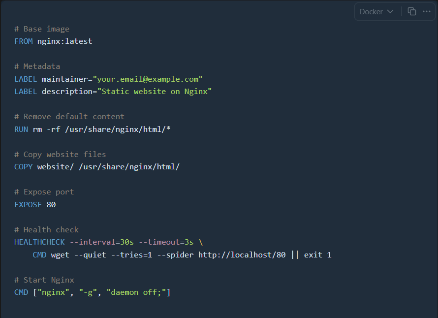
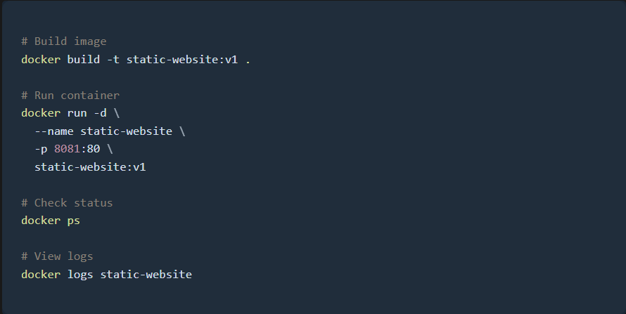
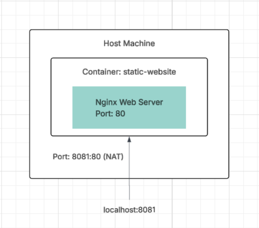
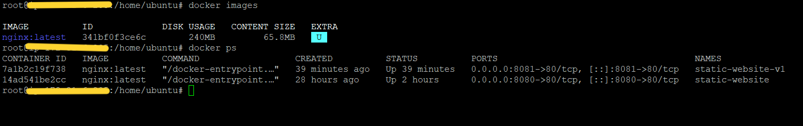
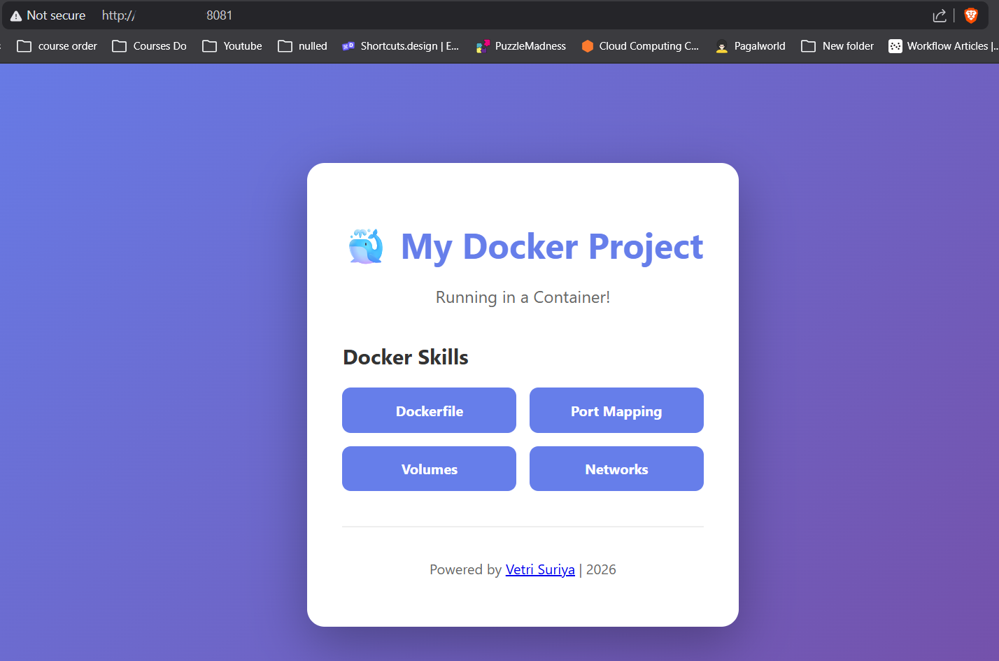

# Docker — Static Website Hosting with Nginx (2 Containers)

> **Project:** Containerised two static HTML websites using Docker + Nginx — one image, two containers, two ports.<br>
> **Stack:** Docker · Nginx (nginx:latest) · Custom Dockerfile · Port Mapping · Static HTML/CSS

---

## Table of Contents

1. [Project Overview](#project-overview)
2. [Architecture Summary](#architecture-summary)
3. [Step 1 — Dockerfile](#step-1--dockerfile)
4. [Step 2 — Build and Run Commands](#step-2--build-and-run-commands)
5. [Step 3 — Port Mapping Flow](#step-3--port-mapping-flow)
6. [Step 4 — docker images and docker ps](#step-4--docker-images-and-docker-ps)
7. [Step 5 — Container 1 Output Port 8081](#step-5--container-1-output-port-8081)
8. [Step 6 — Container 2 Output Port 8080](#step-6--container-2-output-port-8080)
9. [How It All Works Together](#how-it-all-works-together)
10. [Dockerfile Instruction Breakdown](#dockerfile-instruction-breakdown)
11. [Key Technical Insights](#key-technical-insights)
12. [Docker Commands Reference](#docker-commands-reference)
13. [Real-World Use Cases](#real-world-use-cases)
14. [What I Learned](#what-i-learned)

---

## Project Overview

This project demonstrates how to containerise static HTML websites using Docker and Nginx. A custom Docker image was built from a Dockerfile based on `nginx:latest`, with static website files baked directly into the image. Two separate containers were then launched from that single image — each serving a completely different HTML website on a different host port.

Key outcomes:
- One Docker image → two independent containers running simultaneously
- Container 1 (`static-website`) → Port 8080 → SPACDYNA agency website
- Container 2 (`static-website-v1`) → Port 8081 → My Docker Project page
- Both containers fully isolated, independently managed
- HEALTHCHECK built into the image for container health monitoring

---

## Architecture Summary

```
Dockerfile
    |
    |  docker build -t static-website:v1 .
    v
Docker Image: static-website:v1
    |  nginx:latest base, website/ files baked in, 240MB
    |
    |--- docker run -d --name static-website -p 8080:80
    |        v
    |    Container: static-website
    |    Nginx Port 80 (internal)
    |    Host Port 8080 -> Container 80 (NAT)
    |    Site: SPACDYNA Agency
    |
    +--- docker run -d --name static-website-v1 -p 8081:80
             v
         Container: static-website-v1
         Nginx Port 80 (internal)
         Host Port 8081 -> Container 80 (NAT)
         Site: My Docker Project

Browser:
    localhost:8080  ->  SPACDYNA Agency Website
    localhost:8081  ->  My Docker Project Website
```

---

## Step 1 — Dockerfile



```dockerfile
# Base image
FROM nginx:latest

# Metadata
LABEL maintainer="your.email@example.com"
LABEL description="Static website on Nginx"

# Remove default content
RUN rm -rf /usr/share/nginx/html/*

# Copy website files
COPY website/ /usr/share/nginx/html/

# Expose port
EXPOSE 80

# Health check
HEALTHCHECK --interval=30s --timeout=3s \
    CMD wget --quiet --tries=1 --spider http://localhost/80 || exit 1

# Start Nginx
CMD ["nginx", "-g", "daemon off;"]
```

**Instruction-by-Instruction Explanation**

| Instruction | Value | Purpose |
|---|---|---|
| `FROM` | `nginx:latest` | Pull official Nginx base image from Docker Hub |
| `LABEL` | maintainer, description | Metadata embedded in image, visible via docker inspect |
| `RUN` | `rm -rf /usr/share/nginx/html/*` | Remove Nginx default welcome page before copying custom files |
| `COPY` | `website/ to /usr/share/nginx/html/` | Bake custom HTML/CSS/JS files into the image at build time |
| `EXPOSE` | `80` | Document that the container uses port 80 — does NOT publish |
| `HEALTHCHECK` | `wget --spider http://localhost/80` | Monitor Nginx health every 30s with 3s timeout |
| `CMD` | `["nginx", "-g", "daemon off;"]` | Start Nginx in foreground mode — required for Docker PID 1 |

---

## Step 2 — Build and Run Commands



```bash
# Build image
docker build -t static-website:v1 .

# Run container 1 — SPACDYNA site
docker run -d \
  --name static-website \
  -p 8080:80 \
  static-website:v1

# Run container 2 — Docker Project site
docker run -d \
  --name static-website-v1 \
  -p 8081:80 \
  static-website:v1

# Check running containers
docker ps

# View container logs
docker logs static-website
```

**Flag Explanation**

| Flag | Meaning |
|---|---|
| `-d` | Detached mode — container runs in background |
| `--name` | Assign a human-readable name to the container |
| `-p 8080:80` | Map host port 8080 to container port 80 |
| `-p 8081:80` | Map host port 8081 to container port 80 |

---

## Step 3 — Port Mapping Flow



```
Host Machine
    |
    +-- Port 8080 --> Docker NAT --> Container: static-website   --> Nginx Port 80 --> SPACDYNA HTML
    |
    +-- Port 8081 --> Docker NAT --> Container: static-website-v1 --> Nginx Port 80 --> Docker Project HTML
```

Docker creates a virtual network bridge on the host. When you use `-p HOST:CONTAINER`, Docker adds NAT rules that redirect traffic from the host port to the container's internal port. Both containers use port 80 internally with zero conflict because each has its own isolated network namespace.

---

## Step 4 — docker images and docker ps



**docker images**

| IMAGE | DISK USAGE | CONTENT SIZE |
|---|---|---|
| nginx:latest | 240MB | 65.8MB |

**docker ps**

| Image | Status | Ports | Name |
|---|---|---|---|
| nginx:latest | Up 39 minutes | 0.0.0.0:8081→80/tcp | static-website-v1 |
| nginx:latest | Up 2 hours | 0.0.0.0:8080→80/tcp | static-website |

Both containers running simultaneously from the same image on different host ports.

> All container IDs and host IP addresses are redacted.

---

## Step 5 — Container 1 Output Port 8081



Container `static-website-v1` serves the My Docker Project page on `localhost:8081`.

| Property | Value |
|---|---|
| Container Name | `static-website-v1` |
| Host Port | 8081 |
| Container Port | 80 |
| Site Title | My Docker Project |
| Subtitle | Running in a Container! |
| Author | Vetri Suriya / 2026 |

Skills cards displayed: Dockerfile, Port Mapping, Volumes, Networks.

---

## Step 6 — Container 2 Output Port 8080


Container `static-website` serves the SPACDYNA Agency website on `localhost:8080`.

| Property | Value |
|---|---|
| Container Name | `static-website` |
| Host Port | 8080 |
| Container Port | 80 |
| Site Title | SPACDYNA |
| Tagline | We Make Digital Ideas & SEO Marketing |
| Template | Bootstrap 5 HTML Template |
| Navigation | Home, About Us, Services, Portfolio, Blog, Message Us |

---

## How It All Works Together

```
Step 1  Browser requests localhost:8081
Step 2  Host OS receives on port 8081
Step 3  Docker iptables NAT redirects to container network
Step 4  Request reaches static-website-v1 container on port 80
Step 5  Nginx serves static HTML from /usr/share/nginx/html/
Step 6  Response returned to browser

Step 7  HEALTHCHECK runs every 30 seconds in both containers
        wget --spider http://localhost/80
        Success -> container status: healthy
        Failure -> container status: unhealthy -> restart policy triggers
```

---

## Dockerfile Instruction Breakdown

### Why daemon off is Critical

```dockerfile
CMD ["nginx", "-g", "daemon off;"]
```

By default, Nginx forks a background process and the parent exits. Docker monitors PID 1 — when PID 1 exits, Docker stops the container. Without `daemon off;`, Nginx starts, forks, parent exits, and the container stops immediately. With `daemon off;`, Nginx stays in the foreground as PID 1 and the container keeps running.

### Why EXPOSE Does Not Publish the Port

`EXPOSE 80` is documentation only. It tells Docker that the container uses port 80 but does NOT make it accessible from the host. The actual port binding happens at runtime with `-p 8080:80`.

### Why RUN rm Before COPY

```dockerfile
RUN rm -rf /usr/share/nginx/html/*
COPY website/ /usr/share/nginx/html/
```

Removes Nginx's default welcome page before copying your own files — ensures a clean slate with only your content in the html directory.

### Image Layer Caching

Every Dockerfile instruction creates a cached layer. Put infrequently-changed instructions (FROM, LABEL, RUN) before frequently-changed ones (COPY) for fast incremental rebuilds. Only layers from the changed instruction onward are rebuilt.

---

## Key Technical Insights

### Container Network Isolation

Each container gets its own virtual network interface. Two containers can both use port 80 internally without conflict — they live in separate network namespaces, invisible to each other unless explicitly connected via `docker network`.

### HEALTHCHECK Status Values

| Status | Meaning | Action |
|---|---|---|
| starting | Container just started, grace period | No action |
| healthy | Health check passing | Normal operation |
| unhealthy | Health check failing | Restart policy triggers |
| none | No HEALTHCHECK defined | Docker has no app-level visibility |

### One Image → Horizontal Scaling

Launching multiple containers from the same image is the foundation of horizontal scaling. In production this is done with Docker Compose (`scale: 3`), Docker Swarm (`replicas: 3`), or Kubernetes Deployments (`replicas: 3`).

### Immutable Images

The Docker image never changes once built. All containers start from identical state. Any changes inside a running container exist only in that container's writable layer and are lost on `docker rm`.

---

## Docker Commands Reference

```bash
# Build image
docker build -t static-website:v1 .

# Run containers
docker run -d --name static-website -p 8080:80 static-website:v1
docker run -d --name static-website-v1 -p 8081:80 static-website:v1

# List running containers
docker ps

# List all containers including stopped
docker ps -a

# View logs
docker logs static-website

# Inspect container including health status
docker inspect static-website

# Stop and remove
docker stop static-website
docker rm static-website

# Shell into running container
docker exec -it static-website bash

# Remove image
docker rmi static-website:v1
```

---

## Real-World Use Cases

| Use Case | How This Pattern Helps |
|---|---|
| Local development | Run multiple project sites on different ports without config conflicts |
| Microservices | Each service in its own isolated container with its own port |
| CI/CD pipelines | Build a fresh container image on every commit — no server state |
| A/B testing | Run old and new versions side by side, switch traffic between them |
| Multi-tenant hosting | One container per client, fully isolated filesystems |
| Blue/Green deployment | Two containers running simultaneously, route traffic between them |

---

## What I Learned

- `daemon off;` is mandatory for Nginx in Docker — without it, Nginx daemonises and the container exits immediately
- `EXPOSE` is documentation only — the actual port binding happens with `-p` at `docker run` time
- Port mapping is Docker NAT — host port to container port translation via iptables; containers do not know about host ports
- Container network isolation means multiple containers can use the same internal port without conflict
- Image layers are cached — put frequently-changing instructions last (COPY) for fast incremental rebuilds
- HEALTHCHECK enables application-level observability — without it, Docker only knows if the process is running, not if the app is healthy
- One image running as multiple containers is the foundation of horizontal scaling in Docker Swarm and Kubernetes

---