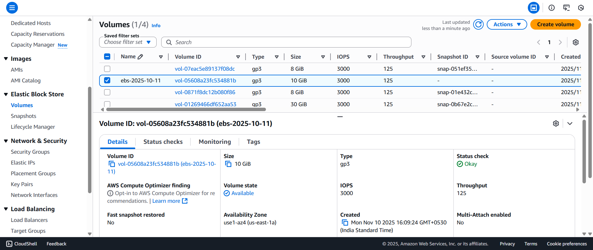
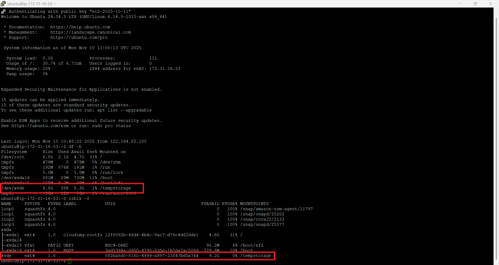
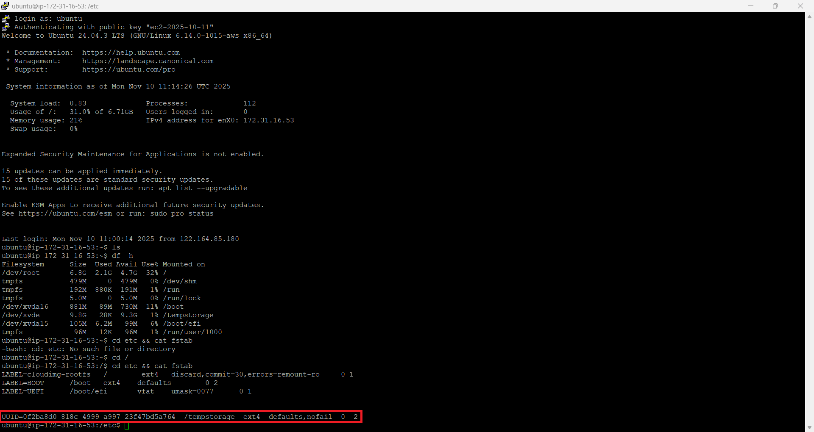
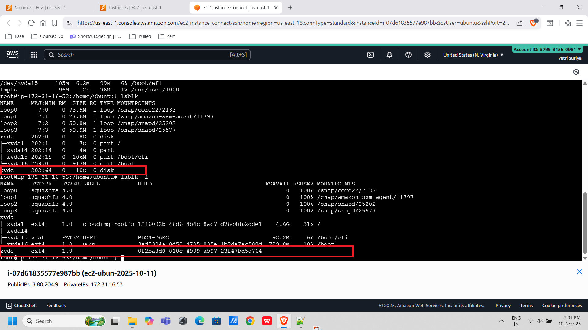
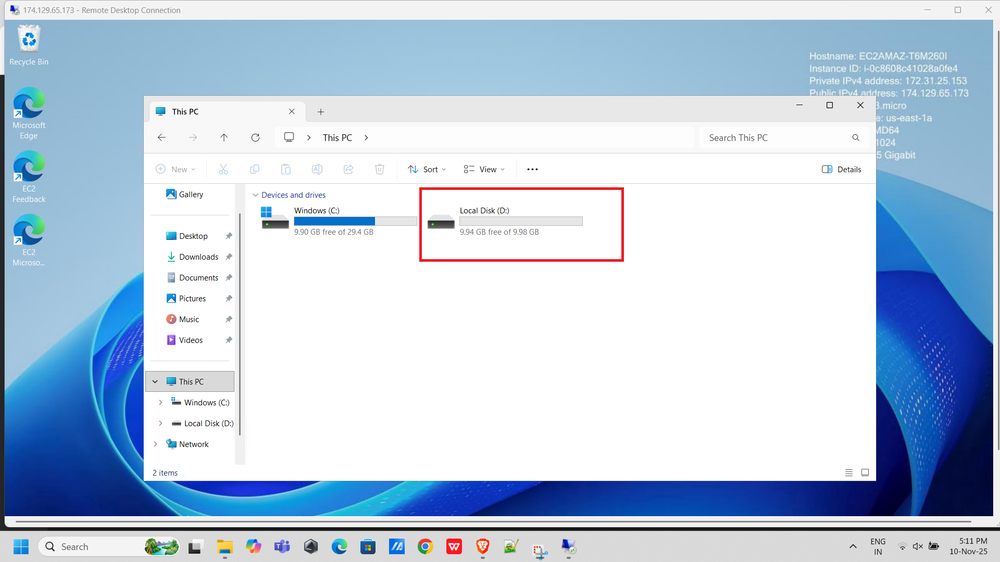

# AWS EBS — Persistent Block Storage Attached to Linux & Windows EC2

> **Project:** Create an EBS volume and attach it as persistent storage on both an Ubuntu Linux and a Windows Server EC2 instance  
> **Volume:** ebs-2025-10-11 · gp3 · 10 GiB  
> **Region:** us-east-1a (N. Virginia)  
> **Stack:** Amazon EBS · EC2 Ubuntu (ext4 · /tempstorage) · EC2 Windows (NTFS · D:)

---

## Table of Contents

1. [Project Overview](#project-overview)
2. [Architecture Summary](#architecture-summary)
3. [Step 1 — EBS Volume Created](#step-1--ebs-volume-created)
4. [Step 2 — Linux: Attach, Format, Mount](#step-2--linux-attach-format-mount)
5. [Step 3 — Linux: /tempstorage Verified](#step-3--linux-tempstorage-verified)
6. [Step 4 — Linux: /etc/fstab Permanent Mount](#step-4--linux-etcfstab-permanent-mount)
7. [Step 5 — Linux: lsblk Before Mount (lsblk)](#step-5--linux-lsblk-verification)
8. [Step 6 — Windows: Local Disk D: Visible](#step-6--windows-local-disk-d-visible)
9. [How It All Works Together](#how-it-all-works-together)
10. [Linux Commands — Full Reference](#linux-commands--full-reference)
11. [Key Technical Insights](#key-technical-insights)
12. [EBS Volume Types](#ebs-volume-types)
13. [EBS vs Instance Store vs EFS](#ebs-vs-instance-store-vs-efs)
14. [Real-World Use Cases](#real-world-use-cases)
15. [What I Learned](#what-i-learned)

---

## Project Overview

This project demonstrates how to create an **Amazon EBS (Elastic Block Store) volume** and attach it as **persistent block storage** to two different EC2 instances — one running Ubuntu Linux and one running Windows Server — showing the OS-specific process for each.

**Key difference from root volumes:** The EBS volume here is a *secondary* volume — separate from the OS root disk. Data stored on it survives EC2 stop/start cycles and persists even if the EC2 instance is terminated (when "Delete on Termination" is Off).

---

## Architecture Summary

```
┌─────────────────────────────────────────────────────────────┐
│              EBS VOLUME ATTACHMENT OVERVIEW                 │
└─────────────────────────────────────────────────────────────┘

EBS Volume: ebs-2025-10-11
    │  gp3 · 10 GiB · 3000 IOPS · 125 MB/s · us-east-1a
    │
    ├──── Attached to Ubuntu Linux EC2 (t2.micro)
    │         → Appears as: /dev/xvde
    │         → Formatted: ext4
    │         → Mounted at: /tempstorage
    │         → Permanent: /etc/fstab (UUID + nofail)
    │         → Contents: index.txt, lost+found
    │
    └──── Attached to Windows Server EC2 (t3.micro)
              → Disk Management: Unallocated → GPT → NTFS
              → Drive Letter: D:
              → Visible as: Local Disk (D:) 9.98 GB
              → Accessible from File Explorer → This PC
```

---

## Step 1 — EBS Volume Created



A new EBS volume was created and is visible in the EC2 Volumes console.

| Property | Value |
|---|---|
| Volume Name | ebs-2025-10-11 |
| Volume ID | `<redacted>` |
| Type | gp3 |
| Size | 10 GiB |
| IOPS | 3000 |
| Throughput | 125 MB/s |
| Availability Zone | us-east-1a |
| Volume State | ✅ Available |
| Multi-Attach | Disabled |
| Fast Snapshot Restore | No |
| Status Check | ✅ Okay |

**Why gp3?**

`gp3` is the current generation General Purpose SSD — it offers better price-performance than `gp2`. Unlike `gp2` where IOPS scales with volume size, `gp3` lets you independently configure IOPS and throughput regardless of size. 3000 IOPS and 125 MB/s are the defaults (free baseline) for any gp3 volume.

---

## Step 2 — Linux: Attach, Format, Mount

The EBS volume was attached to the Ubuntu EC2 instance and formatted as `ext4`:

```bash
# Verify the new disk is detected
lsblk
# Output: xvde 202:64 0 10G 0 disk  (unformatted, no mountpoint)

# Format as ext4
sudo mkfs.ext4 /dev/xvde

# Create the mount point directory
sudo mkdir /tempstorage

# Mount the volume temporarily
sudo mount /dev/xvde /tempstorage

# Verify mount
df -h
# Output: /dev/xvde  9.8G  28K  9.3G  1%  /tempstorage
```

---

## Step 3 — Linux: /tempstorage Verified



The `df -h` and `lsblk -f` outputs confirm the EBS volume is mounted and accessible.

**df -h output (key rows):**

```
Filesystem   Size  Used  Avail  Use%  Mounted on
/dev/xvde    9.8G   28K   9.3G    1%  /tempstorage
```

**lsblk -f output:**

```
NAME   FSTYPE  FSVER  LABEL  UUID                                  FSAVAIL  FSUSE%  MOUNTPOINTS
xvde   ext4    1.0           0f2ba8d0-818c-4999-a997-23f47bd5a764    9.2G       0%  /tempstorage
```

**Contents of /tempstorage:**

```bash
cd /tempstorage
ls
# index.txt  lost+found
```

`lost+found` is created automatically by ext4 on format. `index.txt` was manually created to verify write access and test persistence across reboots.

---

## Step 4 — Linux: /etc/fstab Permanent Mount



To make the mount persistent across reboots, the volume's UUID was added to `/etc/fstab`:

```bash
# Get the UUID of the volume
sudo lsblk -f
# UUID: 0f2ba8d0-818c-4999-a997-23f47bd5a764

# View current fstab
cd / && cat etc/fstab
```

**Complete /etc/fstab:**

```
LABEL=cloudimg-rootfs  /            ext4  discard,commit=30,errors=remount-ro  0 1
LABEL=BOOT             /boot        ext4  defaults                              0 2
LABEL=UEFI             /boot/efi    vfat  umask=0077                           0 1

UUID=0f2ba8d0-818c-4999-a997-23f47bd5a764  /tempstorage  ext4  defaults,nofail  0 2
```

**fstab Field Explanation**

| Field | Value | Meaning |
|---|---|---|
| `UUID=...` | Volume UUID | Stable identifier — won't change on reboot |
| `/tempstorage` | Mount point | Directory where volume is accessible |
| `ext4` | Filesystem type | How the volume is formatted |
| `defaults` | Options | Standard mount options (rw, suid, exec, etc.) |
| `nofail` | Option | Don't fail boot if volume is missing |
| `0` | Dump | No dump backup (0 = disabled) |
| `2` | fsck order | Check this filesystem after root (pass 2) |

**Why `nofail`?**

Without `nofail`, if the EBS volume is detached (e.g., moved to another instance), the instance will **fail to boot** because `/etc/fstab` expects the volume to be present. `nofail` tells the system to continue booting even if this mount fails — critical for production systems.

**Why UUID instead of /dev/xvde?**

Device names like `/dev/xvde` are assigned dynamically at boot. If the hardware configuration changes (adding another volume, for example), the device names can shift — `/dev/xvde` might become `/dev/xvdf`. UUIDs are tied to the filesystem and never change.

---

## Step 5 — Linux: lsblk Verification



`lsblk` confirms the block device layout — `xvde` is the 10G EBS volume attached to the instance:

```
NAME    MAJ:MIN  RM   SIZE  RO  TYPE  MOUNTPOINTS
xvda    202:0     0    8G   0   disk
├─xvda1 202:1     0    7G   0   part  /
├─xvda14 202:14   0    4M   0   part
├─xvda15 202:15   0  106M   0   part  /boot/efi
└─xvda16 259:0    0  913M   0   part  /boot
xvde    202:64    0   10G   0   disk
```

`xvda` is the root OS disk (8 GiB). `xvde` is the newly attached EBS volume (10 GiB) — completely separate from the OS.

---

## Step 6 — Windows: Local Disk D: Visible



On the Windows Server EC2 instance (accessed via RDP), the EBS volume appears as `Local Disk (D:)` in File Explorer after being initialized and formatted.

| Property | Value |
|---|---|
| Drive Letter | D: |
| Label | Local Disk |
| Total Size | 9.98 GB |
| Free Space | 9.94 GB |
| File System | NTFS |
| Visibility | This PC → Devices and drives |

**Windows Setup Steps via Disk Management:**

```
1. Open Disk Management (diskmgmt.msc)
2. New disk appears as "Disk 1 - Unknown - Not Initialized"
3. Right-click → Initialize Disk → select GPT
4. Right-click Unallocated space → New Simple Volume
5. Follow wizard → assign drive letter D:
6. Format with NTFS → Quick Format
7. Volume label: (optional)
8. Finish → drive appears in This PC
```

---

## How It All Works Together

```
┌─────────────────────────────────────────────────────────────┐
│              LINUX FLOW                                     │
└─────────────────────────────────────────────────────────────┘

AWS Console: Create EBS Volume (10 GiB gp3, us-east-1a)
    │
    │ Attach to EC2 Ubuntu (same AZ)
    ▼
EC2 sees /dev/xvde (unformatted block device)
    │
    │ mkfs.ext4 /dev/xvde → creates filesystem
    ▼
mkdir /tempstorage → mount /dev/xvde /tempstorage
    │
    │ df -h confirms mount · lsblk -f shows UUID
    ▼
Add to /etc/fstab → UUID + defaults,nofail
    │
    │ Reboot → auto-mounts at /tempstorage
    ▼
index.txt in /tempstorage → data persists ✓


┌─────────────────────────────────────────────────────────────┐
│              WINDOWS FLOW                                   │
└─────────────────────────────────────────────────────────────┘

AWS Console: Attach EBS Volume to Windows EC2
    │
    │ RDP into Windows instance
    ▼
Disk Management: new disk "Unknown - Not Initialized"
    │
    │ Initialize → GPT → New Simple Volume
    ▼
Format NTFS → Assign drive letter D:
    │
    │ Windows automatically mounts on restart
    ▼
Local Disk (D:) in This PC → 9.98 GB ✓
```

---

## Linux Commands — Full Reference

```bash
# Check block devices (before attach)
lsblk

# After EBS attach — new device appears (e.g., xvde)
lsblk
# xvde  202:64  0  10G  0  disk

# Format the new volume as ext4
sudo mkfs.ext4 /dev/xvde

# Create mount point
sudo mkdir /tempstorage

# Temporary mount (lost on reboot without fstab)
sudo mount /dev/xvde /tempstorage

# Verify mount
df -h

# Get UUID of the volume
sudo lsblk -f
# or: sudo blkid /dev/xvde

# Edit fstab for permanent mount
sudo nano /etc/fstab
# Add line:
# UUID=<your-uuid>  /tempstorage  ext4  defaults,nofail  0 2

# Test fstab without rebooting
sudo umount /tempstorage
sudo mount -a
# If no errors, fstab is correct

# Verify
df -h
ls /tempstorage
```

---

## Key Technical Insights

### 1. EBS is AZ-Locked
An EBS volume can only be attached to an EC2 instance **in the same Availability Zone**. You cannot attach a volume in `us-east-1a` to an instance in `us-east-1b`. To move data across AZs, take a snapshot → create a new volume in the target AZ from the snapshot.

### 2. One Attachment at a Time (Standard Volumes)
Standard EBS volumes can only be attached to **one EC2 instance at a time** (Multi-Attach is only available for `io1`/`io2` volumes). To move a volume between instances: detach from instance A → attach to instance B.

### 3. EBS Persists Beyond Instance Lifecycle
By default (for non-root volumes), EBS data survives instance termination. The "Delete on Termination" setting (which defaults to `true` for root volumes and `false` for additional volumes) controls this behavior.

### 4. gp3 vs gp2
| Feature | gp2 | gp3 |
|---|---|---|
| Baseline IOPS | 3 IOPS/GiB | 3,000 IOPS (flat baseline) |
| Max IOPS | 16,000 | 16,000 |
| Max Throughput | 250 MB/s | 1,000 MB/s |
| IOPS scaling | Tied to size | Independent of size |
| Cost | Standard | 20% cheaper per GiB |

---

## EBS Volume Types

| Type | Class | Max IOPS | Use Case |
|---|---|---|---|
| **gp3** | SSD | 16,000 | General workloads — best price/perf (this project) |
| **gp2** | SSD | 16,000 | Legacy general purpose (migrate to gp3) |
| **io1** | SSD | 64,000 | High-performance databases |
| **io2** | SSD | 256,000 | Mission-critical, durability-sensitive |
| **st1** | HDD | 500 | Big data, log processing, sequential reads |
| **sc1** | HDD | 250 | Cold storage, lowest cost |

---

## EBS vs Instance Store vs EFS

| Feature | EBS | Instance Store | EFS |
|---|---|---|---|
| Type | Block storage | Block storage | File storage |
| Persistence | ✅ Persistent | ❌ Ephemeral (lost on stop) | ✅ Persistent |
| Multi-instance | ❌ Single (standard) | ❌ Single | ✅ Multiple simultaneously |
| AZ scope | Single AZ | Tied to instance | Regional (multi-AZ) |
| Performance | High (SSD/HDD) | Very high (physical NVMe) | Moderate |
| Cost | Per GB provisioned | Included with instance | Per GB used |
| Use case | OS, databases, apps | Temp scratch space, cache | Shared file storage |

---

## Real-World Use Cases

| Use Case | How EBS Helps |
|---|---|
| **Database storage** | Separate DB data volume from OS — resize or snapshot independently |
| **Persistent log storage** | Logs survive instance replacement, can be attached to new instance |
| **Data migration** | Detach from instance A, attach to instance B → instant data transfer |
| **Backup via snapshots** | EBS snapshots to S3 → restore to new volume in any AZ |
| **Separate OS from data** | Root volume (OS) kept small, data volume kept large — independent lifecycle |

---

## What I Learned

- **EBS must be in the same AZ as EC2** — trying to attach a volume from a different AZ fails immediately; this is a hard constraint
- **`lsblk` is the first command** — always run it before and after attaching to confirm the new device name
- **UUID in fstab, never device name** — device names shift; UUIDs are immutable; using the wrong identifier causes boot failures
- **`nofail` is non-negotiable for production** — without it, a detached EBS causes the EC2 to enter an unbootable emergency mode
- **Windows is simpler to set up** — Disk Management GUI handles everything; no CLI commands needed; it automatically persists across reboots
- **Linux requires the full mount pipeline** — mkfs → mkdir → mount → fstab — each step is required; skipping fstab means losing the mount on reboot
- **EBS data is independent of the instance** — the volume can outlive the instance, be snapshotted, and be restored anywhere

---