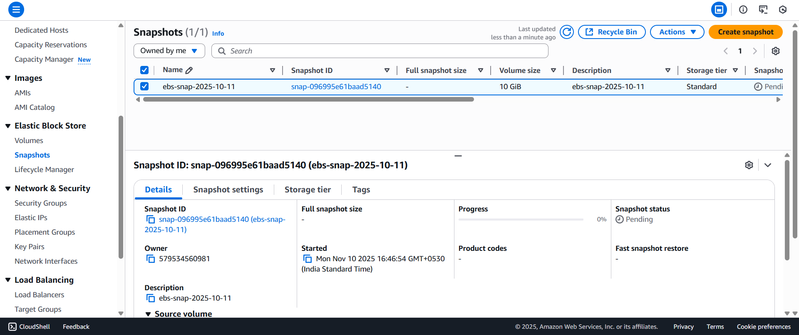
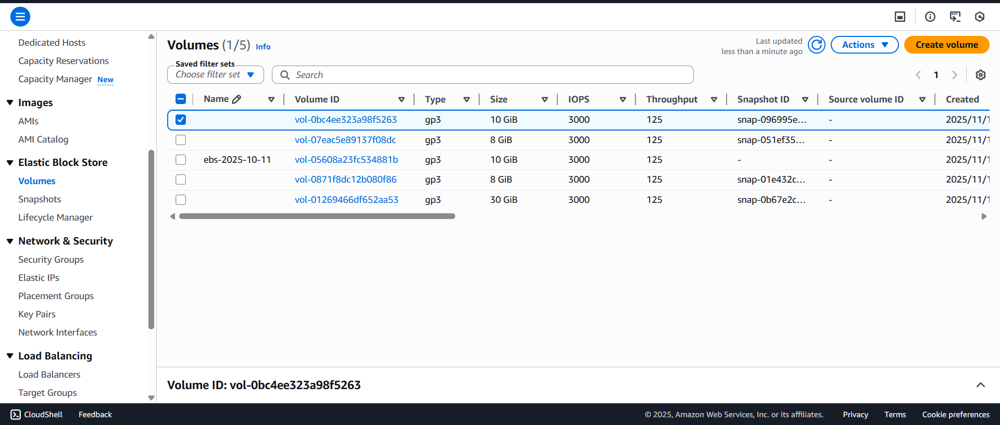
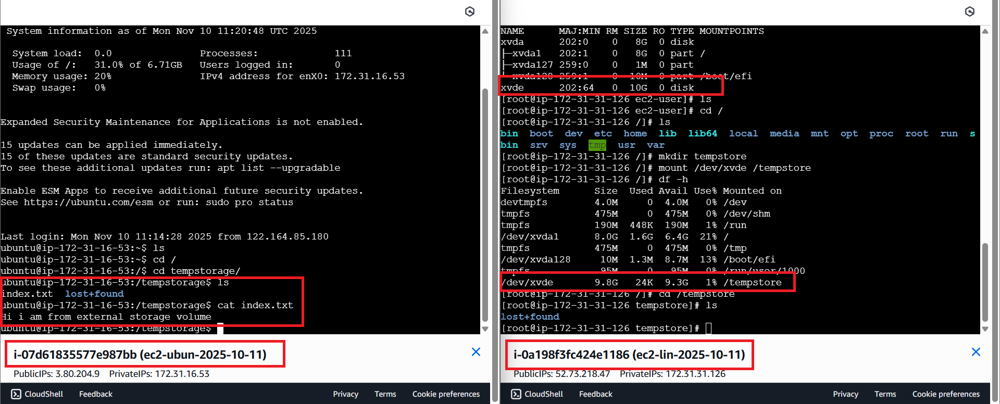

# 📸 EBS Snapshot & Volume Restore

> **Backup an EBS volume → Create snapshot → Restore to new volume → Attach to a different EC2 instance**

| Field      | Value                                       |
|------------|---------------------------------------------|
| **Region** | us-east-1 (N. Virginia)                    |
| **Stack**  | Amazon EBS · EC2 (Ubuntu + Amazon Linux) · EBS Snapshots |
| **Volume Type** | gp3 · 10 GiB · 3000 IOPS · 125 MB/s  |
| **Snapshot Tier** | Standard                              |

---

## 📋 Table of Contents

1. [Project Overview](#-project-overview)
2. [Architecture Summary](#-architecture-summary)
3. [Step 1 — EBS Snapshot Created](#-step-1--ebs-snapshot-created)
4. [Step 2 — EBS Volumes Dashboard](#-step-2--ebs-volumes-dashboard)
5. [Step 3 — Mount & Verify on EC2 Instances](#-step-3--mount--verify-on-ec2-instances)
6. [Key Technical Insights](#-key-technical-insights)
7. [EBS Snapshot Storage Tiers Comparison](#-ebs-snapshot-storage-tiers-comparison)
8. [Fast Snapshot Restore (FSR)](#-fast-snapshot-restore-fsr)
9. [Real-World Use Cases](#-real-world-use-cases)
10. [What I Learned](#-what-i-learned)
11. [Architecture Diagram](#-architecture-diagram)
12. [GitHub Folder Structure](#-github-folder-structure)

---

## 🔍 Project Overview

This project demonstrates the full lifecycle of an **EBS Snapshot** on AWS:

- An existing EBS volume (`ebs-2025-10-11`, gp3, 10 GiB) was attached to an Ubuntu EC2 instance with data on it.
- A **snapshot** was created from that volume, capturing a point-in-time backup.
- A **new EBS volume** was created from the snapshot (restore operation).
- The restored volume was **attached to a different EC2 instance** (Amazon Linux).
- The volume was mounted at `/tempstore` and verified with `lsblk` and `df -h`.

This workflow represents the foundation of **Disaster Recovery**, **Dev/Test Cloning**, and **Cross-Instance Data Migration** on AWS.

---

## 🏗️ Architecture Summary

```
┌─────────────────────────────────────────────────────────────────────────────┐
│                     EBS Snapshot & Restore Flow — us-east-1                │
├─────────────────────────────────────────────────────────────────────────────┤
│                                                                             │
│   Ubuntu EC2 (Source)                                                       │
│   ┌──────────────────┐                                                      │
│   │ ec2-ubun-2025-   │   Volume: ebs-2025-10-11 (gp3, 10 GiB)             │
│   │ 10-11            │──→ /tempstorage/index.txt                           │
│   │ /tempstorage ✓   │       "hi i am from external storage volume"         │
│   └──────────────────┘                                                      │
│           │                                                                 │
│           │ Create Snapshot                                                 │
│           ▼                                                                 │
│   ┌──────────────────┐                                                      │
│   │  EBS Snapshot    │   ebs-snap-2025-10-11                               │
│   │  10 GiB          │   Standard Tier · AWS-managed S3                    │
│   │  Status: Pending │   Incremental backup                                │
│   └──────────────────┘                                                      │
│           │                                                                 │
│           │ Create Volume from Snapshot                                     │
│           ▼                                                                 │
│   ┌──────────────────┐                                                      │
│   │  New EBS Volume  │   gp3 · 10 GiB · 3000 IOPS · 125 MB/s             │
│   │  (Restored)      │   Same AZ as target EC2                             │
│   └──────────────────┘                                                      │
│           │                                                                 │
│           │ Attach → /dev/xvde                                              │
│           ▼                                                                 │
│   Amazon Linux EC2 (Target)                                                 │
│   ┌──────────────────┐                                                      │
│   │ ec2-lin-2025-    │   mkdir /tempstore                                  │
│   │ 10-11            │   mount /dev/xvde /tempstore                        │
│   │ /tempstore ✓     │   df -h → 9.8G available ✅                         │
│   └──────────────────┘                                                      │
│                                                                             │
└─────────────────────────────────────────────────────────────────────────────┘
```

---

## 📷 Step 1 — EBS Snapshot Created



### What This Shows

A snapshot named `ebs-snap-2025-10-11` was created from the source EBS volume.

| Field             | Value                                  |
|-------------------|----------------------------------------|
| **Snapshot Name** | ebs-snap-2025-10-11                   |
| **Snapshot ID**   | `<snapshot-id>` (redacted)            |
| **Volume Size**   | 10 GiB                                |
| **Storage Tier**  | Standard                              |
| **Status**        | Pending (in-progress at capture time) |
| **Started**       | Mon Nov 10, 2025 — 16:46:54 IST       |
| **Owner**         | `<redacted>` (Account ID)             |
| **Description**   | ebs-snap-2025-10-11                   |
| **Progress**      | 0% (just initiated)                   |
| **Fast Snapshot Restore** | Not enabled                 |

### Key Notes

- **Snapshot status = Pending** means the copy operation was in progress. The snapshot becomes usable almost immediately for creating new volumes (lazy-loading).
- The snapshot is stored in **AWS-managed S3** — it does NOT appear in your S3 console bucket list.
- **Full snapshot size** shows `-` because the full copy size is computed after completion.

---

## 📷 Step 2 — EBS Volumes Dashboard



### Volume Inventory at Time of Project

| # | Volume ID       | Name             | Type | Size  | IOPS | Throughput | Snapshot ID       |
|---|-----------------|------------------|------|-------|------|------------|-------------------|
| 1 | `<volume-id-1>` | *(restored)*     | gp3  | 10 GiB | 3000 | 125 MB/s | `<snapshot-id>` |
| 2 | `<volume-id-2>` | *(unnamed)*      | gp3  | 8 GiB  | 3000 | 125 MB/s | `<snapshot-id>` |
| 3 | `<volume-id-3>` | ebs-2025-10-11   | gp3  | 10 GiB | 3000 | 125 MB/s | *(none)*          |
| 4 | `<volume-id-4>` | *(unnamed)*      | gp3  | 8 GiB  | 3000 | 125 MB/s | `<snapshot-id>` |
| 5 | `<volume-id-5>` | *(unnamed)*      | gp3  | 30 GiB | 3000 | 125 MB/s | `<snapshot-id>` |

> All volume IDs and snapshot IDs are redacted for security.

### What This Shows

- **Volume #1** (top, highlighted): The **restored volume** created from the snapshot — notice `Snapshot ID` is populated.
- **Volume #3** (`ebs-2025-10-11`): The **original source volume** — no snapshot ID in "Source volume ID" column (it was the originating volume).
- All volumes are `gp3` type — the default and most cost-effective for general workloads.

---

## 📷 Step 3 — Mount & Verify on EC2 Instances



This screenshot shows two EC2 terminal sessions side by side.

### Left Terminal — Ubuntu EC2 (`ec2-ubun-2025-10-11`) — Source

This is the **original instance** where the EBS volume was first attached with data.

```bash
# Navigate to mounted EBS volume directory
cd /tempstorage

# List contents
ls
# Output: index.txt  lost+found

# Read the file
cat index.txt
# Output: hi i am from external storage volume
```

| Detail         | Value                            |
|----------------|----------------------------------|
| Instance Name  | ec2-ubun-2025-10-11             |
| Instance ID    | `<ec2-instance-id>` (redacted)  |
| Public IP      | `<ec2-public-ip>` (redacted)    |
| Private IP     | `<redacted>`                    |
| Mount Point    | /tempstorage                    |
| Data File      | index.txt                       |
| File Content   | "hi i am from external storage volume" |

---

### Right Terminal — Amazon Linux EC2 (`ec2-lin-2025-10-11`) — Target

This is the **target instance** where the restored volume was attached and mounted.

```bash
# Check block devices
lsblk
# Output:
# NAME      MAJ:MIN  RM  SIZE  RO  TYPE  MOUNTPOINTS
# xvda      202:0     0   8G   0   disk
# ├─xvda1   202:1     0   8G   0   part  /
# ├─xvda127 259:0     0   1M   0   part
# └─xvda128 259:1     0  10M   0   part  /boot/efi
# xvde      202:64    0  10G   0   disk          ← RESTORED VOLUME

# Create mount point directory
cd /
mkdir tempstore

# Mount the restored EBS volume
mount /dev/xvde /tempstore

# Verify mount
df -h
# Output (relevant line):
# /dev/xvde    9.8G   24K   9.3G   1%   /tempstore  ✅

# Navigate and list contents
cd /tempstore
ls
# Output: lost+found
```

| Detail         | Value                            |
|----------------|----------------------------------|
| Instance Name  | ec2-lin-2025-10-11             |
| Instance ID    | `<ec2-instance-id>` (redacted)  |
| Public IP      | `<ec2-public-ip>` (redacted)    |
| Private IP     | `<redacted>`                    |
| Device Name    | /dev/xvde                       |
| Mount Point    | /tempstore                      |
| Available Space | 9.3 GiB (out of 9.8 GiB)      |
| Usage          | 1%                              |

### `lsblk` Output Explained

```
NAME      MAJ:MIN  RM  SIZE  RO  TYPE  MOUNTPOINTS
xvda      ...           8G        disk          ← Root volume (boot disk)
├─xvda1   ...           8G        part  /       ← Root partition
├─xvda127 ...           1M        part          ← BIOS boot
└─xvda128 ...          10M        part  /boot/efi ← EFI boot partition
xvde      ...          10G        disk          ← RESTORED EBS VOLUME ✅
```

---

## 🔑 Key Technical Insights

### 1. Snapshots Are Incremental
- The **first snapshot** copies the entire volume's data blocks.
- All **subsequent snapshots** store only the **changed blocks (deltas)**.
- You are billed only for the unique blocks stored, not for each snapshot's full size.

### 2. AWS-Managed S3 Backing
- Snapshots are stored in **AWS-managed S3** — not visible in your S3 bucket console.
- This is a **durable, highly available** store (11 nines of durability).
- AWS handles replication, consistency, and lifecycle.

### 3. Lazy Loading on Restore
- When you create a volume from a snapshot, the volume is available **immediately**.
- However, data blocks are **lazily loaded** from S3 on first access.
- First-time reads of uninitialized blocks have higher latency until the block is fetched.
- Solution: Use **Fast Snapshot Restore (FSR)** or pre-warm by reading all blocks.

### 4. AZ Constraint
- You must create the restored volume in the **same AZ** as your target EC2 instance.
- EBS volumes are **AZ-local** — they cannot span across AZs.
- To restore in a different AZ or region: **copy the snapshot** first.

### 5. Snapshots Are Crash-Consistent
- A snapshot captures the state of the volume at the moment it is taken.
- For databases: flush writes and briefly quiesce the DB before snapshotting for **application consistency**.

### 6. Volume Type on Restore
- When restoring, you can **change the volume type** (e.g., gp2 → gp3).
- You can also **increase the volume size** during restore.
- You cannot decrease the volume size below the snapshot's used space.

---

## 📊 EBS Snapshot Storage Tiers Comparison

| Feature              | Standard Tier              | Archive Tier                |
|----------------------|----------------------------|-----------------------------|
| **Access Pattern**   | Frequent / Any time        | Infrequent (archive)        |
| **Storage Cost**     | Higher                     | ~75% cheaper                |
| **Restore Time**     | Immediate                  | 24 – 72 hours               |
| **Use Case**         | DR, dev/test cloning       | Long-term compliance, audit |
| **Restore Mechanism**| Direct volume creation     | Must restore to Standard first |
| **Recommended For**  | Prod backups, boot volumes | Old versions, yearly backups |

---

## ⚡ Fast Snapshot Restore (FSR)

| Feature           | Default (No FSR)              | With FSR Enabled             |
|-------------------|-------------------------------|------------------------------|
| **Initial Perf**  | Degraded (lazy loading)       | Full IOPS immediately        |
| **How It Works**  | Blocks fetched on first access | All blocks pre-warmed        |
| **Cost**          | No extra charge               | Per AZ, per hour charge      |
| **Best For**      | Non-latency-critical restores | Databases, boot volumes, DR  |
| **Enable Per**    | N/A                           | Per snapshot, per AZ         |

> **Rule of thumb**: Enable FSR only for snapshots that feed latency-sensitive workloads (prod DBs, frequently restored AMIs).

---

## 🌍 Real-World Use Cases

| Scenario                        | How EBS Snapshots Help                                              |
|---------------------------------|---------------------------------------------------------------------|
| **Disaster Recovery**           | Restore last-known-good volume after data corruption or accidental deletion |
| **Dev/Test Cloning**            | Clone a prod EBS volume to a test instance without touching production |
| **AMI Creation**                | Snapshots are the underlying mechanism for custom AMIs              |
| **Cross-Region Migration**      | Copy snapshot to new region → create volume → attach to new EC2     |
| **Compliance / Audit Trails**   | Retain point-in-time snapshots for regulatory requirements          |
| **Scheduled Backups**           | Use AWS Backup or Data Lifecycle Manager (DLM) to automate          |
| **Database Backup**             | Quiesce DB → snapshot → resume (crash-consistent or app-consistent) |

---

## 💡 What I Learned

1. **Snapshots are NOT instantaneous in terms of performance** — the volume is available immediately but lazy-loaded. For prod DBs, FSR is worth the cost.

2. **You can restore to ANY volume type and size** — this is powerful for migrations (gp2 → gp3) and capacity increases.

3. **EBS volumes are AZ-scoped** — always check that the restored volume is in the same AZ as the target EC2 instance before attaching.

4. **The `lsblk` command** is the first thing to run after attaching a new volume — it shows you the device name (xvde) without a mount point yet.

5. **`df -h`** confirms the mount was successful and shows actual available space. The `lost+found` directory appearing in `/tempstore` confirms the volume has a valid filesystem (ext4).

6. **For SAA-C03**: Know the difference between EBS Snapshots (block-level) and S3 object storage. Snapshots live in AWS-managed S3 but are accessed through the EC2 EBS API, not S3 directly.

7. **Snapshot sharing**: Snapshots can be made **public** or shared with specific AWS accounts — useful for distributing custom AMIs.

---

### `notes/mount-commands.sh` — Quick Reference

```bash
#!/bin/bash
# ─────────────────────────────────────────────────────────────
# EBS Volume: Attach + Mount on Amazon Linux / Ubuntu
# Run as root or with sudo
# ─────────────────────────────────────────────────────────────

# 1. Detect attached volumes
lsblk

# 2. (Optional) Format if brand new and not from snapshot
# mkfs -t ext4 /dev/xvde

# 3. Create mount point
mkdir /tempstore

# 4. Mount the volume
mount /dev/xvde /tempstore

# 5. Verify mount
df -h

# 6. List contents
ls /tempstore

# 7. (Optional) Persist across reboots — add to /etc/fstab
echo "/dev/xvde  /tempstore  ext4  defaults,nofail  0  2" >> /etc/fstab

# 8. Verify fstab is valid
mount -a
```

---