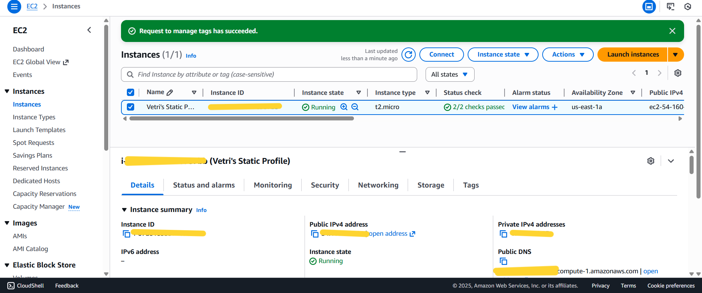
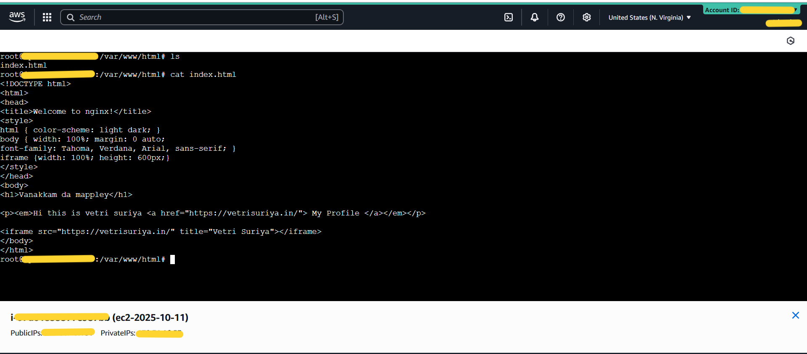
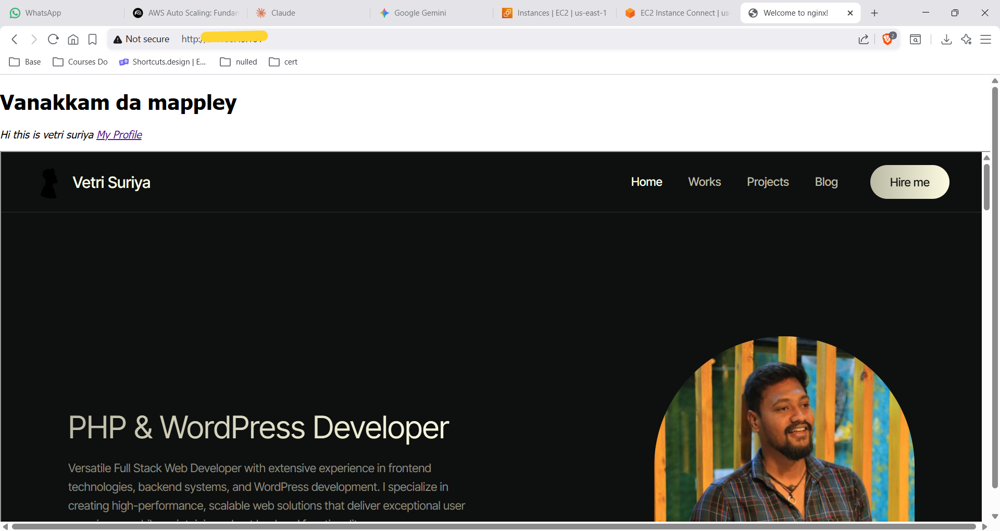

# Static Profile Hosting on EC2 with Nginx

> **Project:** Host a custom static HTML profile page on AWS EC2 Ubuntu using Nginx — with personal portfolio embedded via iframe  
> **Instance Name:** Vetri's Static Profile  
> **Region:** us-east-1 (N. Virginia)
> **Stack:** Amazon EC2 · Ubuntu · Nginx · HTML · iframe

---

## Table of Contents

1. [Project Overview](#project-overview)
2. [Architecture Summary](#architecture-summary)
3. [Step 1 — EC2 Instance](#step-1--ec2-instance)
4. [Step 2 — index.html via EC2 Instance Connect](#step-2--indexhtml-via-ec2-instance-connect)
5. [Step 3 — Live Output](#step-3--live-output)
6. [How It All Works Together](#how-it-all-works-together)
7. [Key Technical Concepts](#key-technical-concepts)
8. [Security Group Configuration](#security-group-configuration)
9. [Nginx Default Document Root](#nginx-default-document-root)
10. [iframe — How Embedding Works](#iframe--how-embedding-works)
11. [Next Steps to Improve](#next-steps-to-improve)
12. [What I Learned](#what-i-learned)

---

## Project Overview

This is a foundational AWS project — hosting a **custom static HTML page on an EC2 Ubuntu instance** using the **Nginx web server**. The page includes a personal greeting, a link to the portfolio, and an **HTML `<iframe>` that embeds the full `vetrisuriya.in` portfolio** directly inside the EC2-hosted page.

The instance was managed entirely through **EC2 Instance Connect** — the browser-based SSH terminal in the AWS console — with no local SSH client or `.pem` key pair file required.

**Result:** A publicly accessible web page served from an EC2 instance on port 80, embedding a live portfolio inside it.

---

## Architecture Summary

```
┌────────────────────────────────────────────────────────────┐
│                     TRAFFIC FLOW                           │
└────────────────────────────────────────────────────────────┘

Browser (Internet User)
    │
    │  HTTP request to EC2 Public IP · Port 80
    ▼
EC2 Instance (Vetri's Static Profile)
    │  t2.micro · Ubuntu · us-east-1a
    │  Security Group: inbound port 80 → 0.0.0.0/0
    │
    ▼
Nginx Web Server
    │  Document root: /var/www/html/
    │  Serves: index.html
    │
    ▼
index.html rendered in browser
    │
    │  <iframe src="https://vetrisuriya.in/">
    ▼
vetrisuriya.in (external portfolio)
    Embedded inside the EC2-served page
```

---

## Step 1 — EC2 Instance



An EC2 instance was launched in **us-east-1a (N. Virginia)** to host the static profile page using Nginx.

| Property | Value |
|---|---|
| Instance Name | Vetri's Static Profile |
| Instance ID | `<redacted>` |
| Instance Type | t2.micro |
| Instance State | ✅ Running |
| Availability Zone | us-east-1a |
| Public IPv4 Address | `<redacted>` |
| Private IPv4 Address | `<redacted>` |
| Status Checks | ✅ 2/2 checks passed |
| OS | Ubuntu Linux |
| Web Server | Nginx |

**Why t2.micro?**

A `t2.micro` instance is more than sufficient for serving a static HTML file — it's essentially just Nginx reading from disk and returning a tiny HTML response. This qualifies for the AWS Free Tier (750 hours/month), making it ideal for learning projects.

**Setup Commands**

```bash
# Update packages
sudo apt update

# Install Nginx
sudo apt install nginx -y

# Verify Nginx is running
sudo systemctl status nginx

# Navigate to web root
cd /var/www/html/

# Edit the index page
sudo nano index.html
```

---

## Step 2 — index.html via EC2 Instance Connect



The page content was written directly on the EC2 instance using **EC2 Instance Connect** — the browser-based SSH terminal accessible from the AWS console without any local tooling.

```bash
root@ip-172-31-16-53:/var/www/html# ls
index.html

root@ip-172-31-16-53:/var/www/html# cat index.html
```

**index.html — Full Content**

```html
<!DOCTYPE html>
<html>
<head>
  <title>Welcome to nginx!</title>
  <style>
    html { color-scheme: light dark; }
    body { width: 100%; margin: 0 auto;
           font-family: Tahoma, Verdana, Arial, sans-serif; }
    iframe { width: 100%; height: 600px; }
  </style>
</head>
<body>
  <h1>Vanakkam da mappley</h1>
  <p><em>Hi this is vetri suriya
    <a href="https://vetrisuriya.in/">My Profile</a>
  </em></p>
  <iframe src="https://vetrisuriya.in/" title="Vetri Suriya"></iframe>
</body>
</html>
```

**HTML Element Breakdown**

| Element | Purpose |
|---|---|
| `<h1>Vanakkam da mappley</h1>` | Page heading — personal greeting |
| `<a href="https://vetrisuriya.in/">` | Direct clickable link to portfolio |
| `<iframe src="https://vetrisuriya.in/">` | Embeds the full portfolio website inside this page |
| `iframe { width: 100%; height: 600px; }` | Makes the iframe full-width with 600px height |

---

## Step 3 — Live Output



Accessing the EC2 public IP in a browser shows the fully rendered page — heading, profile link, and the `vetrisuriya.in` portfolio embedded via iframe.

| Element | What's Shown |
|---|---|
| Heading | "Vanakkam da mappley" |
| Link | "Hi this is vetri suriya · My Profile" |
| iframe content | Full `vetrisuriya.in` portfolio — PHP & WordPress Developer |
| Portfolio nav | Home · Works · Projects · Blog · Hire me |
| Status | ✅ Page live and serving |

> EC2 public IP is redacted for security.

---

## How It All Works Together

```
┌─────────────────────────────────────────────────────────────┐
│                 COMPLETE REQUEST FLOW                       │
└─────────────────────────────────────────────────────────────┘

Step 1 │ User enters EC2 public IP in browser
       │
Step 2 │ Browser sends HTTP GET request to EC2 on Port 80
       │
Step 3 │ EC2 Security Group evaluates: is port 80 inbound allowed?
       │   Yes → traffic passes to the instance
       │
Step 4 │ Nginx receives the request
       │ Looks in document root: /var/www/html/
       │ Finds: index.html → reads it
       │
Step 5 │ Nginx returns index.html as HTTP response
       │
Step 6 │ Browser renders the HTML:
       │   - Displays <h1> heading
       │   - Displays <p> with profile link
       │   - Loads <iframe src="https://vetrisuriya.in/">
       │
Step 7 │ Browser makes a SEPARATE request to vetrisuriya.in
       │ vetrisuriya.in returns its full page
       │ That page is rendered inside the iframe box
       │
Final  │ User sees: EC2-served heading + iframe showing portfolio
```

---

## Key Technical Concepts

### EC2 Instance Connect
EC2 Instance Connect provides a **browser-based SSH session** directly in the AWS console — no `.pem` key file, no local terminal setup. It works by temporarily pushing a one-time public key to the instance's `~/.ssh/authorized_keys` file, establishing a short-lived SSH session.

| Feature | EC2 Instance Connect | Traditional SSH |
|---|---|---|
| Requires local terminal | ❌ | ✅ |
| Requires .pem key file | ❌ | ✅ |
| Accessible from | AWS Console / browser | Local machine |
| Session duration | Temporary (session-based) | Until disconnected |
| Setup effort | Zero | Moderate |

### Nginx Document Root
Nginx's **document root** is the directory where it looks for files to serve. By default on Ubuntu:

```
Document root: /var/www/html/
Default file:  index.html  (served when no specific file is requested)
Config file:   /etc/nginx/sites-available/default
```

When a browser requests `/` (the root URL), Nginx automatically serves `index.html` from the document root.

---

## Security Group Configuration

For this project, the EC2 Security Group must allow HTTP traffic:

**Inbound Rules**

| Port | Protocol | Source | Purpose |
|---|---|---|---|
| 80 | HTTP | 0.0.0.0/0 | Allow public web traffic |
| 22 | SSH | Your IP | EC2 Instance Connect (optional — console-based) |

> **Note:** Opening port 80 to `0.0.0.0/0` makes the page publicly accessible to anyone. For production, consider restricting access or adding HTTPS via ACM + ALB.

---

## Nginx Default Document Root

```
/var/www/html/
    └── index.html   ← Nginx serves this by default
```

**Useful Nginx commands on Ubuntu:**

```bash
# Start Nginx
sudo systemctl start nginx

# Stop Nginx
sudo systemctl stop nginx

# Restart after config changes
sudo systemctl restart nginx

# Check status
sudo systemctl status nginx

# Test config syntax
sudo nginx -t

# View access logs
sudo tail -f /var/log/nginx/access.log

# View error logs
sudo tail -f /var/log/nginx/error.log
```

---

## iframe — How Embedding Works

The `<iframe>` HTML element embeds another HTML page inside the current one. In this project it loads `vetrisuriya.in` inside the EC2-hosted page:

```html
<iframe src="https://vetrisuriya.in/" title="Vetri Suriya"></iframe>
```

**How the browser handles it:**

1. Browser renders the EC2-served `index.html`
2. When it encounters `<iframe src="...">`, it makes a **second, separate HTTP request** to `vetrisuriya.in`
3. `vetrisuriya.in` returns its own full HTML page
4. That page is rendered inside the iframe box within the EC2 page

**iframe Considerations**

| Aspect | Detail |
|---|---|
| Separate request | Browser fetches iframe src independently |
| Cross-origin | Works if the target site allows iframe embedding |
| Size | Controlled via CSS `width` and `height` |
| Security | Some sites block iframe embedding via `X-Frame-Options` header |

---

## Next Steps to Improve

| Enhancement | How |
|---|---|
| Add a custom domain | Route 53 → point domain to EC2 public IP (A record) |
| Enable HTTPS | Add ACM certificate + ALB in front of EC2, or use Let's Encrypt + Certbot |
| Auto-scale the hosting | Move to ALB + ASG + Launch Template |
| Serve via CloudFront | S3 static hosting + CloudFront CDN for global delivery |
| Use S3 instead of EC2 | S3 static website hosting is cheaper for pure static content |

---

## What I Learned

- **Nginx document root** — understanding where Nginx looks for files (`/var/www/html/`) is foundational to web server management
- **EC2 Instance Connect** — browser-based SSH is a fast and convenient way to manage instances without key pair files, ideal for quick edits
- **Security Groups are the gate** — without an inbound rule on port 80, no traffic reaches Nginx regardless of whether it's running
- **HTML iframe makes two requests** — the iframe src is fetched independently by the browser; the EC2 server only serves the wrapper page
- **Public IP vs domain** — EC2 public IPs can change on instance restart; for permanent access, use an Elastic IP or Route 53
- **Static hosting on EC2 is overkill** — for pure static files, S3 + CloudFront is cheaper and more scalable; EC2 makes sense when you need server-side processing (PHP, Node.js, etc.)
- **This is the foundation** — every advanced AWS web project (ALB, ASG, CloudFront) builds on top of this basic EC2 + Nginx pattern

---