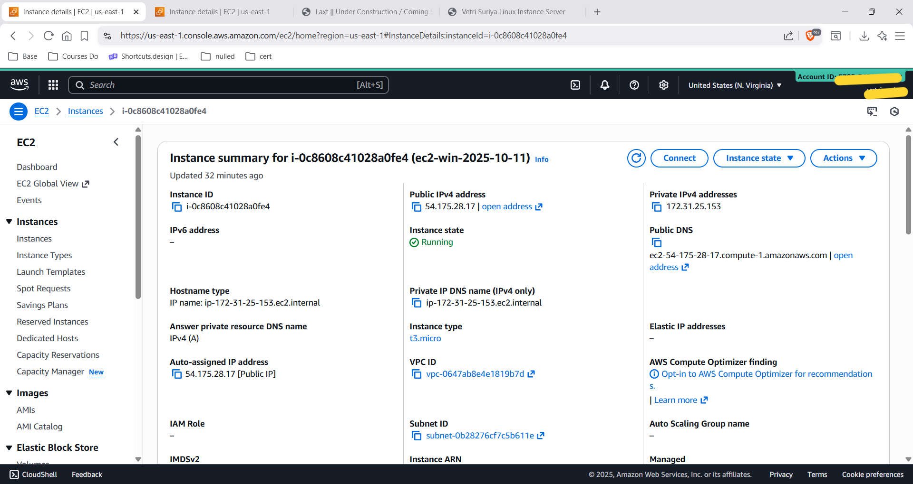
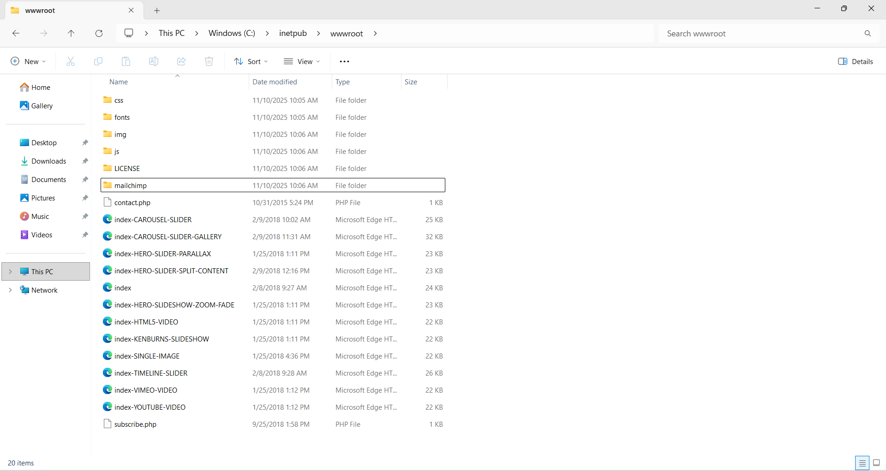
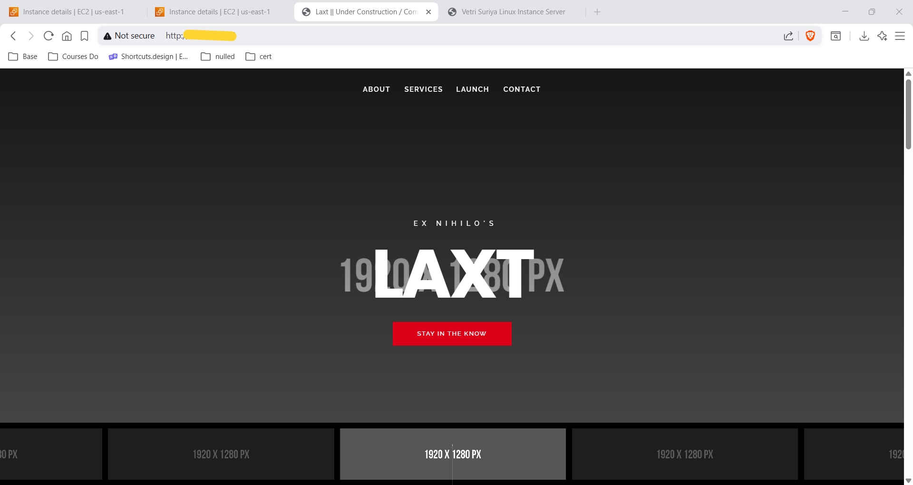

# Static Website Hosting on EC2 Windows Server with IIS

> **Project:** Deploy a professional HTML template on an EC2 Windows Server instance using IIS (Internet Information Services)  
> **Instance Name:** ec2-win-2025-10-11  
> **Region:** us-east-1 (N. Virginia)  
> **Stack:** Amazon EC2 · Windows Server · IIS · HTML/CSS/JS · C:\inetpub\wwwroot\

---

## Table of Contents

1. [Project Overview](#project-overview)
2. [Architecture Summary](#architecture-summary)
3. [Step 1 — EC2 Windows Instance](#step-1--ec2-windows-instance)
4. [Step 2 — wwwroot File Deployment](#step-2--wwwroot-file-deployment)
5. [Step 3 — Live Website Output](#step-3--live-website-output)
6. [How It All Works Together](#how-it-all-works-together)
7. [IIS vs Nginx/Apache — Key Differences](#iis-vs-nginxapache--key-differences)
8. [Linux vs Windows EC2 Hosting](#linux-vs-windows-ec2-hosting)
9. [Security Group Configuration](#security-group-configuration)
10. [IIS Document Root Explained](#iis-document-root-explained)
11. [Real-World Use Cases](#real-world-use-cases)
12. [What I Learned](#what-i-learned)

---

## Project Overview

This project demonstrates **static website hosting on an AWS EC2 Windows Server instance** using **IIS (Internet Information Services)** — the Windows-native web server. A professional LAXT HTML template was deployed to `C:\inetpub\wwwroot\` and served publicly via IIS on port 80.

This is the Windows equivalent of the common Linux EC2 + Nginx/Apache pattern — same result (a static website on port 80), different operating system, different web server, and different management tools.

---

## Architecture Summary

```
┌────────────────────────────────────────────────────────────┐
│                     TRAFFIC FLOW                           │
└────────────────────────────────────────────────────────────┘

Browser (Internet User)
    │
    │  HTTP request to EC2 Public IP · Port 80
    ▼
EC2 Instance (ec2-win-2025-10-11)
    │  t3.micro · Windows Server · us-east-1
    │  Security Group: inbound port 80 → 0.0.0.0/0
    │                  inbound port 3389 → Your IP (RDP)
    │
    ▼
IIS Web Server (Internet Information Services)
    │  Default Web Site · Port 80
    │  Document Root: C:\inetpub\wwwroot\
    │
    ▼
C:\inetpub\wwwroot\index.html
    │  LAXT HTML Template
    │  CSS · JS · Fonts · Images · PHP
    ▼
Browser renders LAXT landing page (dark theme · carousel)
```

---

## Step 1 — EC2 Windows Instance



A Windows Server EC2 instance was launched in **us-east-1 (N. Virginia)** to serve as the IIS web host.

| Property | Value |
|---|---|
| Instance Name | ec2-win-2025-10-11 |
| Instance ID | `<redacted>` |
| Instance Type | t3.micro |
| Instance State | ✅ Running |
| Availability Zone | us-east-1 |
| Public IPv4 Address | `<redacted>` |
| Private IPv4 Address | `<redacted>` |
| OS | Windows Server |
| Web Server | IIS (Internet Information Services) |
| Management | RDP (Remote Desktop Protocol · Port 3389) |

**Why t3.micro for Windows (not t2.micro)?**

Windows Server requires significantly more RAM than a minimal Linux instance. The minimum recommended instance type for a usable Windows Server experience on AWS is `t3.micro` (1 vCPU, 1 GB RAM). `t2.nano` or `t2.micro` may be too resource-constrained for Windows to run IIS reliably.

**Setting up IIS on Windows Server**

IIS is not installed by default on all Windows Server AMIs. To enable it:

```
Server Manager → Manage → Add Roles and Features
    → Server Roles → Web Server (IIS) → Add Features → Install
```

Or via PowerShell:
```powershell
Install-WindowsFeature -Name Web-Server -IncludeManagementTools
```

---

## Step 2 — wwwroot File Deployment



The LAXT HTML template was deployed to `C:\inetpub\wwwroot\` via RDP (Remote Desktop). Files were transferred directly to the IIS document root using Windows Explorer over the RDP session.

**Deployed File Structure**

```
C:\inetpub\wwwroot\                          (20 items total)
├── css\                                      (File folder)
├── fonts\                                    (File folder)
├── img\                                      (File folder)
├── js\                                       (File folder)
├── LICENSE\                                  (File folder)
├── mailchimp\                                (File folder)
├── index.html                                (24 KB · Main entry)
├── index-CAROUSEL-SLIDER.html                (25 KB)
├── index-CAROUSEL-SLIDER-GALLERY.html        (32 KB)
├── index-HERO-SLIDER-PARALLAX.html           (23 KB)
├── index-HERO-SLIDER-SPLIT-CONTENT.html      (23 KB)
├── index-HERO-SLIDESHOW-ZOOM-FADE.html       (23 KB)
├── index-HTML5-VIDEO.html                    (22 KB)
├── index-KENBURNS-SLIDESHOW.html             (22 KB)
├── index-SINGLE-IMAGE.html                   (22 KB)
├── index-TIMELINE-SLIDER.html                (26 KB)
├── index-VIMEO-VIDEO.html                    (22 KB)
├── index-YOUTUBE-VIDEO.html                  (22 KB)
├── contact.php                               (1 KB)
└── subscribe.php                             (1 KB)
```

**Template Variants**

The LAXT template includes **12+ layout variants** — each `index-*.html` file demonstrates a different homepage layout style:

| File | Layout Type |
|---|---|
| `index.html` | Default hero with carousel |
| `index-CAROUSEL-SLIDER.html` | Carousel image slider |
| `index-CAROUSEL-SLIDER-GALLERY.html` | Carousel with gallery grid |
| `index-HERO-SLIDER-PARALLAX.html` | Parallax scrolling hero |
| `index-HERO-SLIDER-SPLIT-CONTENT.html` | Split-screen hero |
| `index-HERO-SLIDESHOW-ZOOM-FADE.html` | Zoom-fade slideshow |
| `index-KENBURNS-SLIDESHOW.html` | Ken Burns effect slideshow |
| `index-SINGLE-IMAGE.html` | Single full-screen image |
| `index-TIMELINE-SLIDER.html` | Timeline-based slider |
| `index-HTML5-VIDEO.html` | HTML5 video background |
| `index-VIMEO-VIDEO.html` | Vimeo-embedded background |
| `index-YOUTUBE-VIDEO.html` | YouTube-embedded background |

IIS serves `index.html` by default when the root URL is accessed — this is configured as the **Default Document** in IIS settings.

---

## Step 3 — Live Website Output



Accessing the EC2 public IP in a browser serves the LAXT template — a dark-themed "Under Construction / Coming Soon" landing page.

| Property | Value |
|---|---|
| URL | `http://<ec2-public-ip>` |
| Theme | LAXT — Dark · Under Construction |
| Navigation | About · Services · Launch · Contact |
| Hero Text | EX NIHILO'S · **LAXT** |
| CTA Button | Stay in the Know |
| Carousel | 1920 × 1280 PX image slider |
| Status | ✅ Serving via IIS |

> EC2 public IP is redacted for security.

---

## How It All Works Together

```
┌─────────────────────────────────────────────────────────────┐
│                 COMPLETE REQUEST FLOW                       │
└─────────────────────────────────────────────────────────────┘

Step 1 │ User enters EC2 public IP in browser
       │
Step 2 │ Browser sends HTTP GET to EC2 on Port 80
       │
Step 3 │ EC2 Security Group: is port 80 inbound allowed?
       │   Yes → traffic passes through
       │
Step 4 │ IIS receives the HTTP request
       │ Checks: Default Web Site bindings → port 80
       │ Looks in document root: C:\inetpub\wwwroot\
       │ Finds: index.html → reads file
       │
Step 5 │ IIS returns index.html as HTTP 200 response
       │
Step 6 │ Browser renders HTML:
       │   - Loads CSS from \css\
       │   - Loads JS from \js\
       │   - Loads images from \img\
       │   - Loads fonts from \fonts\
       │
Step 7 │ LAXT dark landing page fully rendered

Management Flow (RDP):
    Admin PC → RDP (Port 3389) → Windows Desktop
    → Windows Explorer → C:\inetpub\wwwroot\
    → File operations (copy, edit, delete)
```

---

## IIS vs Nginx/Apache — Key Differences

| Aspect | IIS | Nginx / Apache |
|---|---|---|
| Platform | Windows only | Linux (and Windows) |
| Configuration | GUI (IIS Manager) + XML config | Text files (nginx.conf / httpd.conf) |
| Document root | `C:\inetpub\wwwroot\` | `/var/www/html/` |
| Default document | `index.html` (configurable in IIS Manager) | `index.html` |
| Management | GUI or PowerShell | CLI / terminal |
| PHP support | Via PHP Manager for IIS | Via php-fpm module |
| HTTPS | Via IIS bindings + certificate | Via config files |
| Process model | Application Pools | Worker processes |
| AWS EC2 OS | Windows Server | Amazon Linux / Ubuntu / etc. |

---

## Linux vs Windows EC2 Hosting

| Feature | Linux EC2 (Nginx) | Windows EC2 (IIS) |
|---|---|---|
| Web server | Nginx / Apache | IIS |
| Document root | `/var/www/html/` | `C:\inetpub\wwwroot\` |
| Instance management | SSH (port 22) | RDP (port 3389) |
| File management | Terminal / SCP / SFTP | Windows Explorer over RDP |
| Minimum instance type | t2.micro / t2.nano | t3.micro (more RAM needed) |
| Cost | Lower (no Windows license fee) | Higher (Windows Server AMI is priced) |
| Use case | Linux apps, open source stack | .NET / ASP.NET / Windows-only apps |
| Config format | Text-based config files | XML / GUI-based |

---

## Security Group Configuration

**Inbound Rules**

| Port | Protocol | Source | Purpose |
|---|---|---|---|
| 80 | HTTP | 0.0.0.0/0 | Public web access — IIS serves on this port |
| 3389 | RDP | Your IP only | Remote Desktop for Windows management |

> **Security note:** RDP (port 3389) should **never** be opened to `0.0.0.0/0` — restrict it to your specific IP address. Exposing RDP publicly is one of the most common attack vectors for Windows servers.

---

## IIS Document Root Explained

IIS serves web content from its **document root** — by default `C:\inetpub\wwwroot\`:

```
C:\
└── inetpub\              ← IIS installation directory
    ├── wwwroot\          ← Document root (served files live here)
    ├── logs\             ← IIS access and error logs
    └── temp\             ← Temporary ASP.NET files
```

**IIS Default Documents**

IIS is configured to serve a default document when the root URL is accessed. The default document priority order:

```
1. Default.htm
2. Default.asp
3. index.htm
4. index.html    ← This is what serves our LAXT template
5. iisstart.htm
6. default.aspx
```

**Viewing IIS Logs**

```
C:\inetpub\logs\LogFiles\W3SVC1\
    u_ex251110.log   ← Access log for November 10, 2025
```

---

## Real-World Use Cases

| Use Case | Why Windows IIS? |
|---|---|
| **ASP.NET Web Applications** | IIS is required — .NET apps run natively on IIS |
| **Legacy Windows Web Apps** | Migrating IIS apps from on-premises to EC2 |
| **Enterprise organizations** | Windows-first environments with existing IIS expertise |
| **SharePoint hosting** | SharePoint requires IIS on Windows Server |
| **Classic ASP** | Classic ASP only runs on IIS |
| **Mixed-OS testing** | Test how the same HTML behaves on different web servers |

---

## What I Learned

- **IIS is to Windows what Nginx is to Linux** — same role (serve HTTP), completely different ecosystem, config format, and management approach
- **t3.micro is the minimum for Windows** — Windows Server needs more RAM than Linux; trying to run IIS on t2.nano or t2.micro leads to sluggish performance
- **RDP is how you manage Windows EC2** — the equivalent of SSH on Linux; it provides a full Windows desktop experience over the network
- **wwwroot is the IIS document root** — `C:\inetpub\wwwroot\` is where files must be placed for IIS to serve them, just like `/var/www/html/` on Linux
- **Security Group rules are OS-agnostic** — whether Linux or Windows, AWS Security Groups control traffic the same way; only the ports change (22 for SSH vs 3389 for RDP)
- **Windows EC2 AMIs cost more** — Windows Server licensing is included in the EC2 instance price, making Windows instances more expensive than equivalent Linux ones
- **IIS default document is index.html** — no extra config needed; IIS automatically serves `index.html` when the root URL is accessed

---