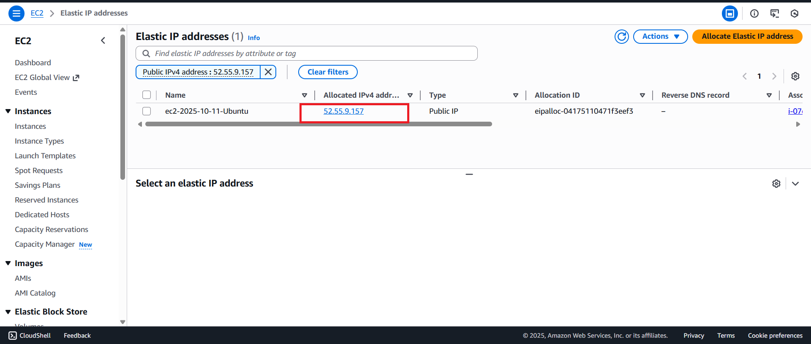
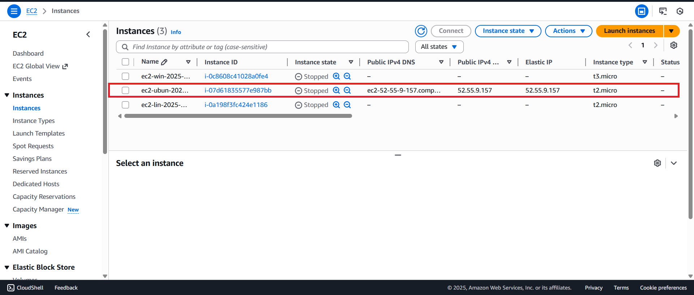

# AWS Elastic IP — Persistent Static IP for EC2 Instance

> **Project:** Allocate and associate an AWS Elastic IP with an EC2 Ubuntu instance to provide a permanent, static public IP address  
> **Instance:** ec2-2025-10-11-Ubuntu  
> **Region:** us-east-1 (N. Virginia)  
> **Stack:** AWS Elastic IP · Amazon EC2 · Ubuntu · Nginx

---

## Table of Contents

1. [Project Overview](#project-overview)
2. [Architecture Summary](#architecture-summary)
3. [Step 1 — Elastic IP Allocated & Associated](#step-1--elastic-ip-allocated--associated)
4. [Step 2 — EC2 Instances — EIP Verified in Console](#step-2--ec2-instances--eip-verified-in-console)
5. [Step 3 — Site Accessible via Elastic IP](#step-3--site-accessible-via-elastic-ip)
6. [How It Works](#how-it-works)
7. [Elastic IP vs Regular Public IP](#elastic-ip-vs-regular-public-ip)
8. [EIP Pricing — Free vs Charged](#eip-pricing--free-vs-charged)
9. [Key Technical Insights](#key-technical-insights)
10. [Real-World Use Cases](#real-world-use-cases)
11. [What I Learned](#what-i-learned)

---

## Project Overview

This project demonstrates how to assign an **AWS Elastic IP (EIP)** to an EC2 Ubuntu instance — solving the problem of changing public IP addresses when an instance is stopped and restarted.

Without an Elastic IP, every EC2 stop/start cycle assigns a new random public IP — breaking DNS records, API endpoints, firewall whitelists, and any direct links to the instance. An Elastic IP provides a **fixed, permanent public IPv4 address** that stays attached to your account and automatically re-associates with the instance on restart.

**Result:** The Ubuntu EC2 instance now has a permanent IP address that persists across stop/start cycles — confirmed by matching values in both the `Public IPv4` and `Elastic IP` columns in the EC2 console.

---

## Architecture Summary

```
┌────────────────────────────────────────────────────────────┐
│          WITHOUT ELASTIC IP (Problem)                      │
└────────────────────────────────────────────────────────────┘

Instance Start #1 → Public IP: 3.84.x.x      ← random
Instance Stop
Instance Start #2 → Public IP: 54.210.x.x    ← different random IP
Instance Stop
Instance Start #3 → Public IP: 18.234.x.x    ← different again

Result: DNS breaks · Bookmarks fail · Whitelists break ❌


┌────────────────────────────────────────────────────────────┐
│          WITH ELASTIC IP (Solution)                        │
└────────────────────────────────────────────────────────────┘

Allocate EIP → <static-ip> (always the same)
Associate with EC2 Ubuntu instance

Instance Start #1 → Public IP: <static-ip>   ← EIP
Instance Stop     → EIP retained by account
Instance Start #2 → Public IP: <static-ip>   ← same EIP
Instance Stop     → EIP retained by account
Instance Start #3 → Public IP: <static-ip>   ← same EIP

Result: DNS always correct · Links never break ✅


TRAFFIC FLOW:
Browser → http://<elastic-ip> → EC2 Ubuntu → Nginx → Profile Page
```

---

## Step 1 — Elastic IP Allocated & Associated



An Elastic IP was allocated and associated with the Ubuntu EC2 instance in us-east-1.

| Property | Value |
|---|---|
| EIP Name | ec2-2025-10-11-Ubuntu |
| Allocated IPv4 | `<redacted>` |
| Type | Public IP |
| Allocation ID | `<redacted>` |
| Associated Instance | ec2-2025-10-11-Ubuntu |
| Reverse DNS Record | — |
| Region | us-east-1 |

**Steps to Allocate and Associate an Elastic IP**

```
EC2 Console → Network & Security → Elastic IPs
    → Allocate Elastic IP address
    → Network Border Group: us-east-1
    → Allocate

Then:
    → Select the allocated EIP
    → Actions → Associate Elastic IP address
    → Resource type: Instance
    → Select instance: ec2-2025-10-11-Ubuntu
    → Associate
```

---

## Step 2 — EC2 Instances — EIP Verified in Console



The EC2 Instances list shows all 3 instances. The critical proof is in the Ubuntu row — both the `Public IPv4` and `Elastic IP` columns show the **same IP address**, confirming the EIP is correctly associated.

| Instance | State | Public IPv4 | Elastic IP | Type |
|---|---|---|---|---|
| ec2-win-2025-... | ⊖ Stopped | — | — | t3.micro |
| **ec2-ubun-202...** | **⊖ Stopped** | **`<EIP>`** | **✓ `<EIP>`** | **t2.micro** |
| ec2-lin-2025-... | ⊖ Stopped | — | — | t2.micro |

**Key observation:** Even though the Ubuntu instance is **Stopped**, the `Public IPv4` column still shows the Elastic IP address. This is what makes EIP different from a regular public IP — a regular IP would show `—` when the instance is stopped, because it gets released back to AWS. The EIP is retained.

---

## Step 3 — Site Accessible via Elastic IP


The Nginx-hosted profile page is accessible at the permanent Elastic IP address — the same IP that will be used every time the instance is started, regardless of how many stop/start cycles occur.

| Property | Value |
|---|---|
| URL | `http://<elastic-ip>` |
| Content | Personal profile page with iframe |
| Heading | Vanakkam da mappley |
| iframe | vetrisuriya.in portfolio embedded |
| Web Server | Nginx on Ubuntu EC2 |
| IP Stability | ✅ Permanent — never changes |

---

## How It Works

```
┌─────────────────────────────────────────────────────────────┐
│             ELASTIC IP LIFECYCLE                            │
└─────────────────────────────────────────────────────────────┘

Step 1 │ Allocate EIP from AWS IPv4 pool
       │ AWS reserves a static IP from its address pool
       │ IP is now "owned" by your account
       │
Step 2 │ Associate EIP with EC2 instance
       │ AWS replaces the instance's auto-assigned public IP
       │ with the Elastic IP
       │
Step 3 │ Instance running → traffic flows through EIP
       │ Browser → EIP → EC2 → Nginx → response
       │
Step 4 │ Instance stopped
       │ Auto-assigned public IP → released (normal behavior)
       │ Elastic IP → RETAINED by your account ✓
       │
Step 5 │ Instance restarted
       │ Elastic IP → automatically re-associated ✓
       │ Same IP as before → DNS still works ✓
       │
Step 6 │ Need to replace EC2 instance?
       │ Disassociate EIP from old instance
       │ Associate EIP with new instance
       │ Same IP → zero downtime for DNS/clients ✓
```

---

## Elastic IP vs Regular Public IP

| Feature | Regular Public IP | Elastic IP (EIP) |
|---|---|---|
| Assignment | Random on instance start | Fixed, chosen from AWS pool |
| Persistence on stop | ❌ Released (gone) | ✅ Retained by account |
| Persistence on start | Gets new random IP | Same IP re-associated |
| DNS reliability | ❌ Breaks on restart | ✅ Always consistent |
| Moveable between instances | ❌ No | ✅ Yes — disassociate/reassociate |
| Cost | Free (included) | Free with running instance |
| Quantity limit | 1 per instance | 5 per region (soft limit) |
| Use with Route 53 A record | ❌ Unreliable (IP changes) | ✅ Reliable (IP never changes) |

---

## EIP Pricing — Free vs Charged

AWS Elastic IP pricing is designed to discourage hoarding of IPv4 addresses:

| Scenario | Cost |
|---|---|
| EIP associated with a **running** EC2 instance | ✅ **Free** |
| EIP associated with a **stopped** EC2 instance | 💰 Charged per hour |
| EIP **allocated but not associated** (idle) | 💰 Charged per hour |
| More than 1 EIP per running instance | 💰 Additional EIPs are charged |

**Best practice:** Always release EIPs that are no longer needed. Don't let them sit unattached — you'll be billed for idle IPv4 addresses.

```bash
# Disassociate EIP from instance
# EC2 Console → Elastic IPs → Actions → Disassociate

# Release EIP (returns it to AWS pool)
# EC2 Console → Elastic IPs → Actions → Release Elastic IP addresses
```

---

## Key Technical Insights

### 1. EIP is Account-Level, Not Instance-Level
An Elastic IP belongs to your AWS **account**, not to a specific EC2 instance. You can move it between instances freely. This makes EIP the right tool for:
- Replacing an EC2 instance with zero downtime (launch new → associate EIP → terminate old)
- Disaster recovery (failover to a standby instance in seconds)

### 2. Private IP Does Not Change
EC2 private IP addresses (e.g., `172.31.x.x`) never change on stop/start. Only the **public** IP changes. EIP solves the public IP stability problem — the private IP was never an issue.

### 3. One EIP Per Instance (Free Tier Rule)
AWS allows one free Elastic IP per running EC2 instance. The second EIP on the same instance starts incurring charges. This is per-instance, not per-account.

### 4. EIP Works with Multiple Services
Elastic IPs are not limited to EC2 — they can also be associated with:
- NAT Gateways
- Network Load Balancers
- Network Interfaces (ENIs)

### 5. IPv4 Address Shortage
AWS charges for idle EIPs because **public IPv4 addresses are a finite, scarce resource**. AWS is gradually transitioning toward IPv6 to address this scarcity. Starting February 2024, AWS also charges $0.005/hr for all public IPv4 addresses (including those auto-assigned to running instances).

---

## Real-World Use Cases

| Use Case | Why Elastic IP? |
|---|---|
| **DNS A records** | Route 53 A record points to EC2 — EIP ensures it always resolves correctly |
| **SSL/TLS certificates** | Domain must consistently resolve for cert validation |
| **API endpoints** | Client applications hardcode the IP — EIP prevents breakage |
| **Firewall whitelisting** | Corporate firewalls allow-list specific IPs — EIP never changes |
| **Blue/Green deployments** | Move EIP from blue to green instance instantly — same IP, new server |
| **Disaster recovery** | Failover: associate EIP with standby instance in another AZ |
| **NAT Gateway** | EIP gives NAT Gateway a fixed public IP for outbound traffic |

---

## What I Learned

- **Regular EC2 public IPs are ephemeral** — they are released the moment an instance stops; you get a new random IP on restart; this is by design
- **EIP solves the stability problem** — one allocation, one fixed address that belongs to your account until you release it
- **EIP costs money when idle** — AWS charges for unattached or stopped-instance EIPs to discourage IP address hoarding; always release unused EIPs
- **EIP is account-scoped, not instance-scoped** — you can move it to any instance, NAT Gateway, or ENI in the same region
- **Private IPs never change** — only public IPs change on stop/start; EIP is only relevant for public-facing access
- **5 EIPs per region by default** — this is a soft limit that can be increased via AWS Support ticket
- **EIP + Route 53** is the foundation of reliable DNS for EC2-hosted services — without EIP, an A record pointing to EC2 becomes unreliable after any instance restart

---