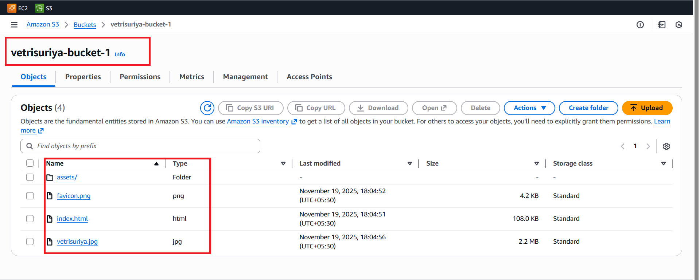
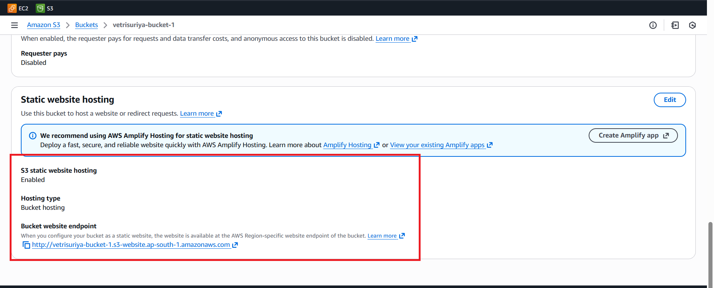
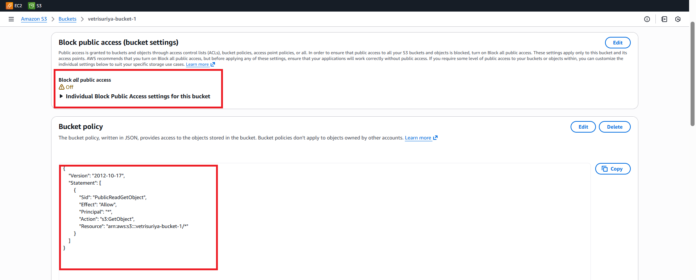
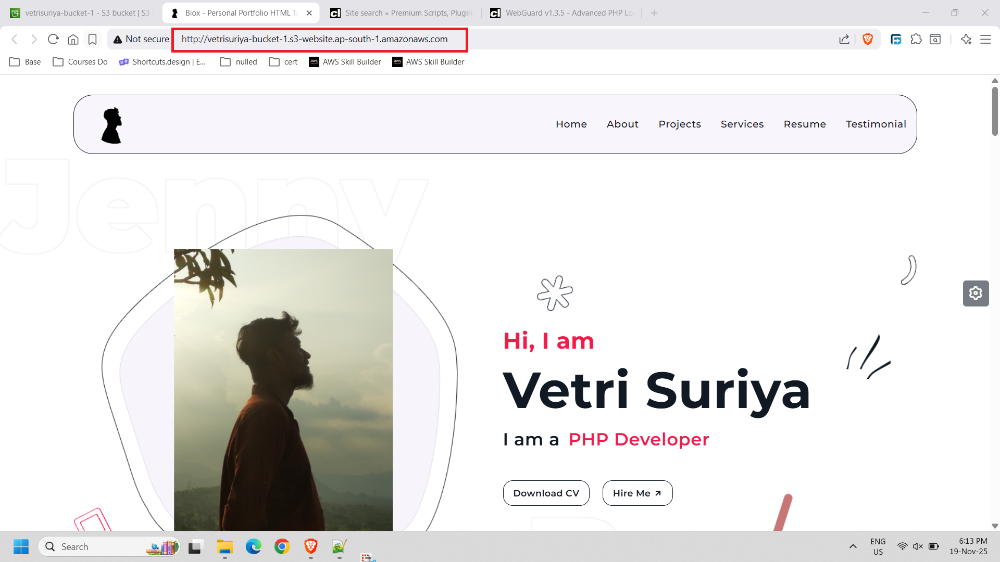

# 🪣 S3 Static Website Hosting

> **Upload HTML/CSS/JS to S3 → Enable Static Hosting → Public Bucket Policy → Portfolio Live on S3 Endpoint**

| Field             | Value                                                          |
|-------------------|----------------------------------------------------------------|
| **Bucket Name**   | vetrisuriya-bucket-1                                          |
| **Region**        | ap-south-1 (Mumbai)                                           |
| **Stack**         | Amazon S3 · Static Website Hosting · Bucket Policy           |
| **Endpoint**      | http://vetrisuriya-bucket-1.s3-website.ap-south-1.amazonaws.com |
| **Visibility**    | Public (Block All Public Access = OFF)                        |

---

## 📋 Table of Contents

1. [Project Overview](#-project-overview)
2. [Architecture Summary](#-architecture-summary)
3. [Step 1 — S3 Bucket & Uploaded Objects](#-step-1--s3-bucket--uploaded-objects)
4. [Step 2 — Static Website Hosting Enabled](#-step-2--static-website-hosting-enabled)
5. [Step 3 — Permissions: Block Public Access OFF + Bucket Policy](#-step-3--permissions-block-public-access-off--bucket-policy)
6. [Step 4 — Live Portfolio Website](#-step-4--live-portfolio-website)
7. [Key Technical Insights](#-key-technical-insights)
8. [S3 Website Endpoint vs REST Endpoint](#-s3-website-endpoint-vs-rest-endpoint)
9. [S3 Static Hosting vs CloudFront + S3](#-s3-static-hosting-vs-cloudfront--s3)
10. [Real-World Use Cases](#-real-world-use-cases)
11. [What I Learned](#-what-i-learned)
12. [Architecture Diagram](#-architecture-diagram)
13. [GitHub Folder Structure](#-github-folder-structure)

---

## 🔍 Project Overview

This project demonstrates how to host a **static website on Amazon S3** — no EC2, no web server, no server management.

The portfolio website for Vetri Suriya (PHP Developer) was built as a static HTML/CSS/JS site and deployed directly to an S3 bucket in **ap-south-1 (Mumbai)**.

The setup involved:
1. Creating an S3 bucket (`vetrisuriya-bucket-1`)
2. Uploading all static files (HTML, images, assets)
3. Enabling **Static Website Hosting** in the Properties tab
4. Disabling **Block All Public Access**
5. Adding a **Bucket Policy** that allows public `s3:GetObject`
6. Accessing the portfolio at the S3 website endpoint URL

> **Note**: This is different from Project #2 (CloudFront + S3 with OAC), which uses a **private** bucket + CloudFront distribution. This project uses **direct S3 hosting** with a public bucket — simpler but HTTP-only.

---

## 🏗️ Architecture Summary

```
┌─────────────────────────────────────────────────────────────────────────────┐
│                    S3 Static Website Hosting — ap-south-1                  │
├─────────────────────────────────────────────────────────────────────────────┤
│                                                                             │
│   Developer (Local)                                                         │
│   ┌──────────────┐   Upload files   ┌─────────────────────────────────┐    │
│   │ index.html   │ ───────────────► │  S3 Bucket: vetrisuriya-bucket-1│    │
│   │ favicon.png  │                  │  Region: ap-south-1             │    │
│   │ vetrisuriya  │                  │  Storage: Standard              │    │
│   │ .jpg         │                  │  ┌──────────────────────────┐   │    │
│   │ assets/      │                  │  │ Objects (4):             │   │    │
│   └──────────────┘                  │  │ • assets/  (folder)      │   │    │
│                                     │  │ • favicon.png  (4.2 KB)  │   │    │
│                                     │  │ • index.html  (108 KB)   │   │    │
│   Configure:                        │  │ • vetrisuriya.jpg (2.2MB)│   │    │
│   → Static hosting: Enabled         │  └──────────────────────────┘   │    │
│   → Block public: OFF               │                                  │    │
│   → Bucket policy: s3:GetObject *   └──────────────┬────────────────┘    │
│                                                     │                       │
│                                                     │ S3 Website Endpoint   │
│                                                     ▼                       │
│   Internet User (Browser)                                                   │
│   ┌──────────────┐   HTTP GET   ┌──────────────────────────────────────┐   │
│   │ Browser      │ ───────────► │ http://vetrisuriya-bucket-1          │   │
│   │              │              │ .s3-website.ap-south-1.amazonaws.com │   │
│   │ Portfolio ✅ │ ◄─────────── │ → Serves index.html + assets         │   │
│   └──────────────┘              └──────────────────────────────────────┘   │
│                                                                             │
│   ⚠️  HTTP only — No HTTPS on S3 website endpoint                          │
│   ⚠️  Bucket is publicly readable — anyone can access objects               │
│                                                                             │
└─────────────────────────────────────────────────────────────────────────────┘
```

---

## 📷 Step 1 — S3 Bucket & Uploaded Objects



### Bucket Details

| Field              | Value                   |
|--------------------|-------------------------|
| **Bucket Name**    | vetrisuriya-bucket-1    |
| **Region**         | ap-south-1 (Mumbai)     |
| **Total Objects**  | 4 (1 folder + 3 files)  |
| **Console Tab**    | Objects                 |

### Object Inventory

| Name             | Type   | Size      | Storage Class | Last Modified          |
|------------------|--------|-----------|---------------|------------------------|
| `assets/`        | Folder | —         | —             | —                      |
| `favicon.png`    | png    | 4.2 KB    | Standard      | Nov 19, 2025 18:04:52  |
| `index.html`     | html   | 108.0 KB  | Standard      | Nov 19, 2025 18:04:51  |
| `vetrisuriya.jpg`| jpg    | 2.2 MB    | Standard      | Nov 19, 2025 18:04:56  |

### Key Observations
- All objects use **Standard** storage class — appropriate for frequently accessed website assets.
- `index.html` at 108 KB suggests a rich, pre-built static site (likely a portfolio template with inline CSS/JS).
- `vetrisuriya.jpg` at 2.2 MB is the profile photo — for production, consider compression.
- `assets/` folder likely contains CSS, JavaScript, and additional image files.

---

## 📷 Step 2 — Static Website Hosting Enabled



### Configuration

| Setting                   | Value                                                                    |
|---------------------------|--------------------------------------------------------------------------|
| **S3 static website hosting** | Enabled                                                             |
| **Hosting type**          | Bucket hosting                                                           |
| **Bucket website endpoint** | `http://vetrisuriya-bucket-1.s3-website.ap-south-1.amazonaws.com`     |

### How to Enable (Console Steps)

1. Open the S3 bucket → click **Properties** tab
2. Scroll down to **Static website hosting** → click **Edit**
3. Select **Enable**
4. Set **Index document**: `index.html`
5. (Optional) Set **Error document**: `error.html`
6. Click **Save changes**

### Key Notes
- AWS recommends Amplify Hosting for static sites (shown in the info box) — but direct S3 hosting still works well for learning and simple use cases.
- The endpoint URL is **HTTP** — not HTTPS. This is a hard limitation of the S3 website endpoint.
- The endpoint format: `http://{bucket-name}.s3-website.{region}.amazonaws.com`

---

## 📷 Step 3 — Permissions: Block Public Access OFF + Bucket Policy



### Block Public Access Settings

| Setting                  | Value                     |
|--------------------------|---------------------------|
| **Block all public access** | **OFF** ⚠️             |
| Individual settings      | All disabled              |

> **Warning**: Turning off Block All Public Access exposes your bucket to the internet. Only do this for intentionally public resources like static websites.

### Bucket Policy

```json
{
    "Version": "2012-10-17",
    "Statement": [
        {
            "Sid": "PublicReadGetObject",
            "Effect": "Allow",
            "Principal": "*",
            "Action": "s3:GetObject",
            "Resource": "arn:aws:s3:::vetrisuriya-bucket-1/*"
        }
    ]
}
```

### Bucket Policy Breakdown

| Field          | Value                                 | Meaning                                              |
|----------------|---------------------------------------|------------------------------------------------------|
| `Version`      | `2012-10-17`                          | IAM policy language version (always use this)       |
| `Sid`          | `PublicReadGetObject`                 | Statement ID — human-readable label                  |
| `Effect`       | `Allow`                               | Grants the permission                               |
| `Principal`    | `"*"`                                 | Anyone (all users, anonymous internet)              |
| `Action`       | `s3:GetObject`                        | Permission to read/download objects                 |
| `Resource`     | `arn:aws:s3:::vetrisuriya-bucket-1/*` | All objects in the bucket (`/*` wildcard)           |

### Why Both Settings Are Required

To serve a public S3 website:
1. **Block All Public Access = OFF** — this removes the safety guard
2. **Bucket Policy with `Principal: *`** — this explicitly grants read access

Both must be configured together. The bucket policy alone won't work if Block Public Access is still ON.

---

## 📷 Step 4 — Live Portfolio Website



### Website Details

| Detail           | Value                                                                    |
|------------------|--------------------------------------------------------------------------|
| **URL**          | `http://vetrisuriya-bucket-1.s3-website.ap-south-1.amazonaws.com`       |
| **Protocol**     | HTTP (⚠️ Not Secure — shown in browser)                                  |
| **Content**      | Portfolio — "Hi, I am Vetri Suriya — I am a PHP Developer"              |
| **Navigation**   | Home · About · Projects · Services · Resume · Testimonial               |
| **CTA Buttons**  | "Download CV" · "Hire Me"                                               |

### Key Observations

- Browser shows **"Not secure"** warning — expected for HTTP-only S3 endpoints
- The site loads successfully from the S3 website endpoint — proof that hosting, permissions, and policy are all correctly configured
- **vetrisuriya.jpg** loads as the profile photo — shows the image object is also publicly accessible
- The portfolio is a modern, responsive HTML/CSS template

---

## 🔑 Key Technical Insights

### 1. Two Steps to Enable Public Access
You must do **both** of these — one alone won't work:
- Turn off **Block All Public Access** (removes the safety block)
- Add a **Bucket Policy** with `s3:GetObject` for `Principal: *` (grants the actual permission)

### 2. S3 Storage Class for Website Assets
Standard storage class is correct for website content:
- Frequently accessed (every page load)
- Low latency retrieval
- No retrieval fees (unlike Glacier)

### 3. Index Document Is Mandatory
Without setting an **index document** (`index.html`), S3 will return an XML listing error or a 403 when users hit the root URL. Always set the index document when enabling static hosting.

### 4. Large Image Optimization
The profile photo (`vetrisuriya.jpg`) is **2.2 MB** — large for a web asset. For production:
- Compress to < 200KB using WebP format
- Use responsive images (`srcset`)
- Consider serving via CloudFront with image optimization

### 5. No Server-Side Processing
S3 can only serve **static** content:
- HTML, CSS, JavaScript ✅
- Images, fonts, PDFs ✅
- PHP scripts ❌ (not executed — served as text)
- Backend APIs ❌

For PHP execution, you still need an EC2/Lightsail or Lambda + API Gateway.

---

## 📊 S3 Website Endpoint vs REST Endpoint

| Feature                    | Website Endpoint                                | REST Endpoint                              |
|----------------------------|-------------------------------------------------|--------------------------------------------|
| **URL format**             | `bucket.s3-website.region.amazonaws.com`        | `bucket.s3.region.amazonaws.com`           |
| **Protocol**               | HTTP only                                       | HTTPS                                      |
| **Index document support** | ✅ Yes (`index.html`)                           | ❌ No                                      |
| **Error document support** | ✅ Yes (`error.html`)                           | ❌ No (returns XML error)                  |
| **Static website hosting** | ✅ Required for hosting                         | ❌ Not suitable for hosting                |
| **Use case**               | Static website delivery                         | Programmatic S3 API access                 |

> **Rule**: Always use the **website endpoint** for static website hosting. Use the REST endpoint for programmatic S3 SDK/CLI access.

---

## 📊 S3 Static Hosting vs CloudFront + S3

| Feature              | S3 Direct (This Project)         | CloudFront + S3 (Project #2)          |
|----------------------|----------------------------------|---------------------------------------|
| **HTTPS**            | ❌ HTTP only                     | ✅ HTTPS with ACM cert                |
| **Custom Domain**    | ⚠️ Possible, no SSL             | ✅ With SSL                           |
| **Bucket Exposure**  | ⚠️ Public bucket                | ✅ Private bucket (OAC)               |
| **Edge Caching**     | ❌ Single region                 | ✅ 400+ global PoPs                   |
| **DDoS Protection**  | ❌ None                          | ✅ Shield Standard                    |
| **Setup Time**       | ✅ ~5 minutes                    | ⚠️ ~15–20 minutes                    |
| **Cost**             | ✅ S3 only                       | ⚠️ S3 + CloudFront                   |
| **Best For**         | Learning, dev, internal          | Production public websites            |

---

## 🌍 Real-World Use Cases

| Scenario                      | How S3 Static Hosting Helps                                          |
|-------------------------------|----------------------------------------------------------------------|
| **Personal Portfolio**        | Host resume/portfolio with zero server management                    |
| **Static Marketing Sites**    | Product landing pages with no backend requirement                    |
| **Dev Documentation**         | Gatsby, Hugo, Jekyll, or VuePress output hosted cheaply              |
| **CI/CD Static Deployments**  | GitHub Actions/CodePipeline pushes builds directly to S3             |
| **Internal Dashboards**       | Restrict with IAM or VPC endpoint for private access                 |
| **React/Vue/Angular SPAs**    | Build output (dist/) deployed to S3 with CloudFront for HTTPS        |
| **Error Pages**               | Custom error pages for other services pointing back to S3            |

---

## 💡 What I Learned

1. **Block Public Access is a two-layer system** — you need to turn it off AND add a bucket policy. Either alone is insufficient.

2. **S3 website endpoint vs REST endpoint** — a critical distinction. The website endpoint is specifically designed for browser consumption (index documents, custom errors). The REST endpoint is for API/SDK access.

3. **HTTP-only limitation** — this is not configurable. The S3 website endpoint will never support HTTPS natively. For production, CloudFront is mandatory if you need HTTPS.

4. **Image sizing matters** — 2.2 MB for a profile image is large. In production, I'd convert to WebP and reduce to < 200KB for fast page loads.

5. **S3 is not a web server** — it doesn't process PHP, Python, or any server-side code. It only serves files as-is. Understanding this boundary is key to knowing when S3 alone is sufficient vs when you need compute.

6. **For SAA-C03**: Know when to recommend S3 static hosting vs CloudFront+S3. Exam questions often ask about HTTPS requirements, private buckets, or global distribution — all pointing to CloudFront.

---

### Quick Reference: Enable S3 Static Hosting via AWS CLI

```bash
# 1. Create bucket
aws s3 mb s3://vetrisuriya-bucket-1 --region ap-south-1

# 2. Upload all files
aws s3 sync ./website/ s3://vetrisuriya-bucket-1/

# 3. Enable static website hosting
aws s3 website s3://vetrisuriya-bucket-1/ \
  --index-document index.html \
  --error-document error.html

# 4. Disable block public access
aws s3api put-public-access-block \
  --bucket vetrisuriya-bucket-1 \
  --public-access-block-configuration \
    "BlockPublicAcls=false,IgnorePublicAcls=false,BlockPublicPolicy=false,RestrictPublicBuckets=false"

# 5. Apply public read bucket policy
aws s3api put-bucket-policy \
  --bucket vetrisuriya-bucket-1 \
  --policy '{
    "Version": "2012-10-17",
    "Statement": [{
      "Sid": "PublicReadGetObject",
      "Effect": "Allow",
      "Principal": "*",
      "Action": "s3:GetObject",
      "Resource": "arn:aws:s3:::vetrisuriya-bucket-1/*"
    }]
  }'

# 6. Get the website endpoint URL
aws s3api get-bucket-website --bucket vetrisuriya-bucket-1
```

---