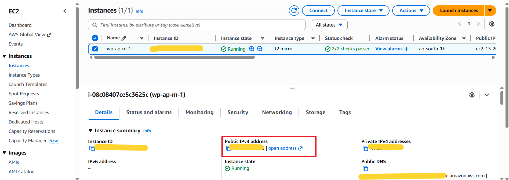
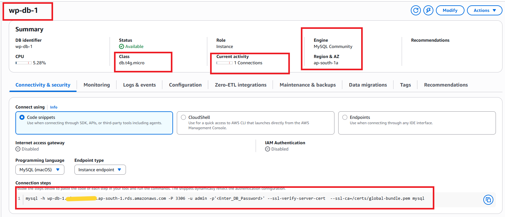
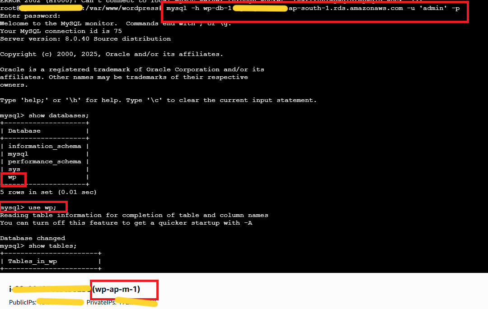
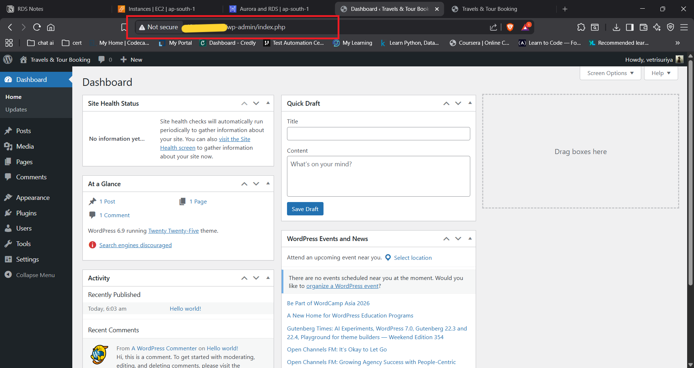
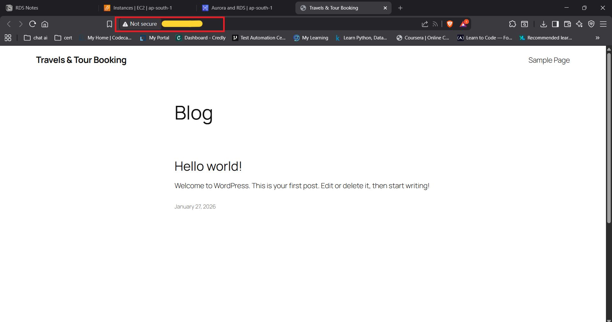

# WordPress on EC2 with Amazon RDS MySQL — 2-Tier Architecture

> **Project:** Host WordPress on EC2 with Amazon RDS MySQL as the managed database backend  
> **Site Name:** Travels & Tour Booking  
> **Region:** ap-south-1 (Mumbai)  
> **Stack:** Amazon EC2 · Amazon RDS MySQL · WordPress 6.9 · Apache · PHP

---

## Table of Contents

1. [Project Overview](#project-overview)
2. [Architecture Summary](#architecture-summary)
3. [Step 1 — EC2 Instance Setup](#step-1--ec2-instance-setup)
4. [Step 2 — RDS MySQL Database](#step-2--rds-mysql-database)
5. [Step 3 — MySQL Connection Verified](#step-3--mysql-connection-verified)
6. [Step 4 — WordPress Admin Dashboard](#step-4--wordpress-admin-dashboard)
7. [Step 5 — WordPress Frontend Live](#step-5--wordpress-frontend-live)
8. [How It All Works Together](#how-it-all-works-together)
9. [Key Technical Insights](#key-technical-insights)
10. [EC2 + RDS vs Single-Instance WordPress](#ec2--rds-vs-single-instance-wordpress)
11. [Security Configuration](#security-configuration)
12. [Real-World Use Cases](#real-world-use-cases)
13. [What I Learned](#what-i-learned)

---

## Project Overview

This project demonstrates how to host a **WordPress website on an Amazon EC2 instance** while using **Amazon RDS (MySQL)** as the managed database backend — implementing a proper **2-tier architecture** that separates the application layer from the data layer.

The core problem this solves: when WordPress runs with a local MySQL database on the same EC2 instance, the data is tightly coupled to that instance. If the instance is stopped, terminated, or replaced, all WordPress content is at risk. By moving the database to Amazon RDS, the data layer becomes independent, persistent, and managed.

**Result:** A fully functional WordPress website — "Travels & Tour Booking" — with the admin dashboard and frontend both live and accessible, backed by a properly managed RDS MySQL database.

---

## Architecture Summary

```
┌─────────────────────────────────────────────────────────────┐
│                    2-TIER ARCHITECTURE                      │
└─────────────────────────────────────────────────────────────┘

Browser / Internet User
    │
    │  HTTP · Port 80
    ▼
EC2 Instance (wp-ap-m-1)          ←──── APP TIER
    │  t2.micro · ap-south-1b
    │  Amazon Linux
    │  Apache + PHP + WordPress 6.9
    │  wp-config.php → RDS Endpoint
    │
    │  MySQL · Port 3306
    ▼
RDS Instance (wp-db-1)            ←──── DATA TIER
    │  MySQL Community 8.0.40
    │  db.t4g.micro · ap-south-1a
    │  Database: wp
    │  1 Active Connection
    ▼
WordPress Database (wp)
    └── All posts, pages, users, settings stored here
```

---

## Step 1 — EC2 Instance Setup



An EC2 instance was launched to serve as the **application tier** — running the WordPress PHP application and Apache web server.

| Property | Value |
|---|---|
| Instance Name | `wp-ap-m-1` |
| Instance ID | `<redacted>` |
| Instance Type | t2.micro |
| Instance State | ✅ Running |
| Availability Zone | ap-south-1b |
| Public IPv4 Address | `<redacted>` |
| Private IPv4 Address | `<redacted>` |
| Status Checks | ✅ 2/2 checks passed |
| OS | Amazon Linux |

**Software Installed on EC2**

| Component | Purpose |
|---|---|
| Apache HTTP Server | Web server — receives browser requests on Port 80 |
| PHP | Server-side scripting — processes WordPress code |
| WordPress 6.9 | CMS application |
| MySQL Client | CLI tool to connect to RDS from the EC2 terminal |

**Key Configuration — wp-config.php**

The most important change in this project is updating `wp-config.php` to point WordPress at the RDS endpoint instead of `localhost`:

```php
// Before (single-instance setup)
define('DB_HOST', 'localhost');

// After (EC2 + RDS setup)
define('DB_HOST', '<rds-endpoint>');  // redacted
define('DB_NAME', 'wp');
define('DB_USER', 'admin');
define('DB_PASSWORD', '<password>');  // redacted
```

This single change is what connects WordPress to the external RDS database instead of a local one.

---

## Step 2 — RDS MySQL Database



Amazon RDS was used to host the **WordPress MySQL database** as a fully managed service — handling backups, patching, and monitoring automatically.

| Property | Value |
|---|---|
| DB Identifier | `wp-db-1` |
| Engine | MySQL Community |
| Engine Version | 8.0.40 |
| DB Instance Class | db.t4g.micro |
| Status | ✅ Available |
| Role | Instance |
| Region & AZ | ap-south-1a |
| Current Activity | 1 Connections |
| CPU Utilization | 5.28% |
| Internet Access Gateway | Disabled |
| IAM Authentication | Disabled |
| Endpoint Type | Instance endpoint |

**Connection Command (from RDS Console)**

```bash
mysql -h <rds-endpoint> -P 3306 -u admin -p'<password>' \
  --ssl-verify-server-cert \
  --ssl-ca=/certs/global-bundle.pem mysql
```

> RDS endpoint and credentials are redacted for security.

**Why db.t4g.micro?**

The `db.t4g.micro` (ARM-based Graviton) instance class provides a cost-effective option for low-traffic WordPress sites. It offers better price-performance than the older `db.t2.micro` and is sufficient for a development/demo WordPress installation.

**RDS vs MySQL on EC2**

| Aspect | RDS MySQL | MySQL on EC2 |
|---|---|---|
| Management | Fully managed by AWS | Manual — you manage OS + MySQL |
| Automated Backups | ✅ Built-in | ❌ Manual setup required |
| Multi-AZ Failover | ✅ One setting to enable | ❌ Complex manual setup |
| OS Patching | ✅ AWS handles it | ❌ Manual |
| Cost | Slightly higher | Lower, but more work |
| Recommended for | Production workloads | Dev/test only |

---

## Step 3 — MySQL Connection Verified



From inside the EC2 instance, the connection to RDS was verified using the `mysql` CLI. This is the critical proof that the 2-tier architecture is working correctly.

**Terminal Output**

```bash
root@wp-ap-m-1:/var/www/wordpress$ mysql -h <rds-endpoint> -u 'admin' -p
Enter password:
Welcome to the MySQL monitor.  Commands end with ; or \g.
Your MySQL connection id is 75
Server version: 8.0.40 Source distribution

mysql> show databases;
+--------------------+
| Database           |
+--------------------+
| information_schema |
| mysql              |
| performance_schema |
| sys                |
| wp                 |   ← WordPress database ✓
+--------------------+
5 rows in set (0.01 sec)

mysql> use wp;
Database changed

mysql> show tables;
+----------------------+
| Tables_in_wp         |   ← WordPress core tables confirmed ✓
+----------------------+
```

**What this proves:**

- EC2 can successfully reach the RDS instance over port 3306 ✅
- The `wp` database exists on RDS ✅
- WordPress tables have been created (WordPress installer ran successfully) ✅
- The Security Group rules are correctly configured to allow EC2 → RDS traffic ✅

> **Note:** The initial error at the top of the terminal (`ERROR 2002`) was from an earlier connection attempt to localhost before the configuration was updated. After pointing to the RDS endpoint, the connection succeeded.

---

## Step 4 — WordPress Admin Dashboard



WordPress admin dashboard is fully accessible, confirming the WordPress installation completed successfully and is reading/writing data to the RDS database.

| Property | Value |
|---|---|
| URL | `<ec2-public-ip>/wp-admin/index.php` |
| Site Name | Travels & Tour Booking |
| WordPress Version | 6.9 |
| Active Theme | Twenty Twenty-Five |
| Posts | 1 |
| Pages | 1 |
| Comments | 1 |
| Admin User | `vetrisuriya` |
| Status | ✅ Dashboard Live |

**At a Glance Stats**

The "At a Glance" widget confirms WordPress has successfully written default content to the RDS database — the default post "Hello world!" and the default page are both stored in the `wp` database on RDS.

---

## Step 5 — WordPress Frontend Live



The WordPress frontend is publicly accessible via the EC2 public IP, serving the "Travels & Tour Booking" blog.

| Property | Value |
|---|---|
| URL | `<ec2-public-ip>` |
| Site Title | Travels & Tour Booking |
| Active Page | Blog |
| Published Post | Hello world! |
| Post Date | January 27, 2026 |
| Status | ✅ Frontend Serving |

The frontend content (posts, pages, site title) is all served dynamically from the WordPress PHP application on EC2, which reads data from the `wp` database on RDS — completing the full 2-tier flow.

---

## How It All Works Together

```
┌─────────────────────────────────────────────────────────────┐
│                 COMPLETE REQUEST FLOW                       │
└─────────────────────────────────────────────────────────────┘

Step 1 │ User visits <ec2-public-ip> in browser
       │
Step 2 │ Browser sends HTTP request to EC2 on Port 80
       │
Step 3 │ Apache receives request → passes to PHP interpreter
       │
Step 4 │ PHP loads WordPress bootstrap (wp-load.php)
       │
Step 5 │ WordPress reads wp-config.php
       │   DB_HOST = RDS endpoint
       │   DB_NAME = wp
       │
Step 6 │ WordPress opens MySQL connection to RDS on Port 3306
       │
Step 7 │ RDS validates connection (Security Group + credentials)
       │
Step 8 │ RDS returns requested data (posts, pages, settings)
       │
Step 9 │ WordPress renders HTML from PHP templates + DB data
       │
Step 10│ Apache returns rendered HTML to browser
       │
       │ ── ADMIN FLOW ──
       │
Step A │ User visits /wp-admin → WordPress authentication check
Step B │ Credentials validated against wp_users table in RDS
Step C │ Admin dashboard rendered with live DB stats
```

---

## Key Technical Insights

### 1. wp-config.php is the Bridge
The entire 2-tier architecture hinges on one file: `wp-config.php`. Changing `DB_HOST` from `localhost` to the RDS endpoint is what moves WordPress from a single-instance setup to a properly decoupled architecture. Everything else in WordPress stays the same.

### 2. Security Group Configuration is Critical
For EC2 to connect to RDS, the RDS Security Group must have an **inbound rule** on port 3306 that allows the EC2 Security Group as the source (not a public IP). This means:
- RDS is **not exposed to the internet** — only EC2 can reach it
- If the EC2 instance is replaced, as long as it uses the same Security Group, it can still connect to RDS

```
EC2 Security Group (source)
    │
    │ Port 3306 (MySQL)
    ▼
RDS Security Group (inbound rule)
```

### 3. RDS is in a Different AZ than EC2
The EC2 instance is in `ap-south-1b` and RDS is in `ap-south-1a`. This is a common real-world pattern — placing them in separate AZs provides some resilience. For full HA, RDS Multi-AZ should be enabled, which automatically maintains a standby replica in another AZ.

### 4. Data Persists Across EC2 Replacements
Because all WordPress data lives in RDS:
- Stop/start the EC2 instance → WordPress data is safe
- Terminate and re-launch EC2 → re-install Apache/PHP/WordPress, point wp-config.php to the same RDS endpoint, and all content is immediately available
- Replace EC2 with a larger instance type → same story — RDS retains everything

### 5. RDS Multi-AZ vs Read Replica

| Feature | Multi-AZ | Read Replica |
|---|---|---|
| Purpose | High Availability | Read Performance |
| Standby | Synchronous replica in another AZ | Asynchronous replica |
| Failover | ✅ Automatic (60-120 sec) | ❌ Manual promotion |
| Use Case | Production HA | Reporting, analytics, read scaling |
| Extra cost | ~2× instance cost | Additional instance cost |

---

## EC2 + RDS vs Single-Instance WordPress

| Aspect | EC2 Only (Local MySQL) | EC2 + RDS (This Project) |
|---|---|---|
| DB location | On EC2 disk | Managed RDS |
| Data on EC2 termination | ❌ Lost | ✅ Safe in RDS |
| Automated backups | ❌ Manual | ✅ RDS automated |
| OS patching for DB | ❌ Manual | ✅ AWS managed |
| Multi-AZ failover | ❌ Complex | ✅ One click |
| Read scaling | ❌ Not possible | ✅ Add Read Replicas |
| Production readiness | ❌ Dev/test only | ✅ Production ready |
| Complexity | Lower | Moderate |
| Cost | Lower | Slightly higher |

---

## Security Configuration

### Security Groups Required

**EC2 Security Group (Inbound)**

| Port | Protocol | Source | Purpose |
|---|---|---|---|
| 80 | HTTP | 0.0.0.0/0 | WordPress frontend + admin |
| 22 | SSH | Your IP | EC2 management |

**RDS Security Group (Inbound)**

| Port | Protocol | Source | Purpose |
|---|---|---|---|
| 3306 | MySQL/Aurora | EC2 Security Group ID | WordPress → RDS connection |

> **Important:** The RDS security group source should be the **EC2 Security Group ID** — not a public IP or `0.0.0.0/0`. This ensures RDS is only reachable from the EC2 instance and never directly from the internet.

---

## Real-World Use Cases

| Use Case | How This Architecture Helps |
|---|---|
| **WordPress blog** | Persistent data even if EC2 instance is replaced |
| **Business website** | Managed DB with automated backups for compliance |
| **WooCommerce e-commerce** | RDS handles order/product data reliably |
| **Multi-instance WordPress** | Multiple EC2 instances behind ALB, all sharing one RDS |
| **Dev → Prod promotion** | Snapshot RDS, restore in prod environment |
| **CloudFront + EC2 + RDS** | Add CloudFront in front for global HTTPS delivery |

---

## What I Learned

- **wp-config.php is the key** — one line change (`DB_HOST`) moves the entire database from localhost to a managed RDS service
- **Security Groups must be correctly chained** — RDS must allow the EC2 Security Group (not a public IP) on port 3306; public exposure of the DB port is a serious security risk
- **RDS and EC2 in different AZs** is a natural setup — cross-AZ database connections add a small amount of latency but provide better resilience
- **Data decoupling is fundamental** — the moment you separate compute from storage, your application becomes much more resilient and manageable
- **RDS Multi-AZ vs Read Replica** serve completely different purposes — Multi-AZ is for availability, Read Replica is for performance; many people confuse the two
- **The mysql CLI is the fastest way to verify connectivity** — `show databases` and `show tables` confirm both the network path and the WordPress setup in one step
- **RDS automates the boring parts** — no more manually managing MySQL config files, log rotation, or OS-level database backups

---